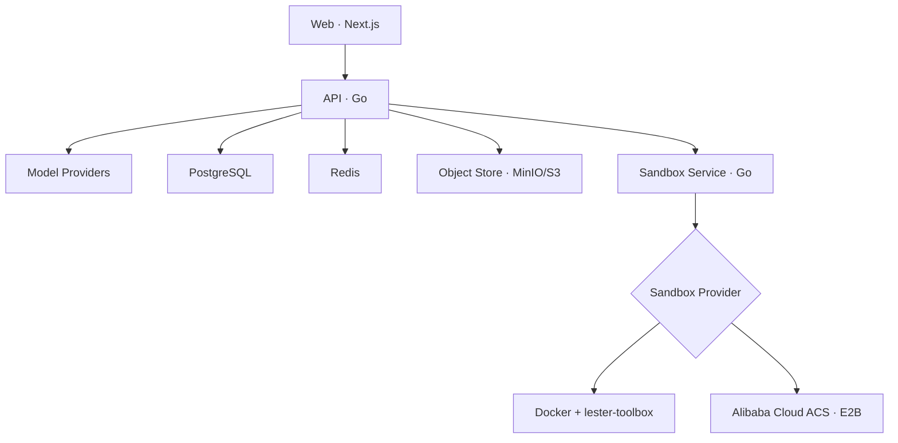

# Lester

**Lester 是一个开源、可自部署的 AI Agent Workspace。**

它以对话为主要入口：用户创建对话、选择 Agent 和模型，然后让 Agent 在用户专属 Computer 的独立会话目录中完成任务。

> Lester 不是 Workflow/DAG 编排平台，不提供拖拽节点、条件分支或流程画布。

## Lester 能做什么

- 使用邮箱和密码注册、登录，自动创建个人 Workspace
- 左下角账户菜单统一进入个人资料、模型、Computer 和 Skill 设置；称呼与内置头像主题可持久化修改
- 在 Workspace 中配置自己的模型 Provider 和密钥
- 支持 OpenAI、Anthropic、Azure OpenAI、OpenAI-compatible、AWS Bedrock、Google Vertex AI 和 Microsoft Foundry
- 通过 Workspace 级 SSE 实时输出 Agent 回复和当前思考/工具活动；刷新后按持久化事件游标无重复续流，左侧会话栏仅在会话运行或正在停止时展示状态，并用一次性未读提示告知后台任务完成或失败；运行区展示当前动作和耗时，发送键在运行期间变为停止键，可随时终止当前任务
- 完整保存中间回复、工具调用与工具结果；模型请求按完整 ToolExchange 管理工作集，默认保留最近 10 次工具交互
- 单次任务不限制模型/工具循环次数；运行会持续到模型完成、发生明确错误或运行上下文被取消
- 创建对话时选择 Lester、Franklin、Michael 或 Trevor；同一对话内角色保持不变
- 为每个用户分配一个 Computer（本地 Docker 或阿里云 ACS Agent Sandbox），并以 `/workspace/conversations/{conversationId}` 隔离会话目录
- Agent 可以在 Computer 中执行命令、读写文件和使用终端
- 右侧 Files 提供类似 VS Code 的目录树与文件预览，支持代码/文本行号、图片、PDF，以及受限 iframe 中的 HTML 页面预览、源码切换和独立页面打开；桌面端可拖动调整右侧面板宽度，并可收起左侧会话栏
- 文件工作区支持最多 8 个打开标签、Markdown 预览/源码、下载、放大预览和窄屏文件面板。聊天下方的任务文件卡片只展示已确认存在的当前文件；“让 Agent 修改此文件”会给输入框添加可移除的文件引用，发送时只附相对路径提示，不自动注入文件内容。
- 会话栏支持按标题搜索；文件目录按内容占用高度，变化列表按需展开。专注预览可暂时收起目录，预览/源码与文件操作集中在同一工具栏，为内容留出更多空间。
- 文件列表在文件操作及工具/任务结束事件后自动同步；页面可见时，运行中每 5 秒、空闲每 15 秒检查文件元数据，覆盖 bash 和后台脚本的变更。扫描最多 64 个目录、2000 个文件、5 层子目录，默认跳过依赖、缓存和 `.agent` 目录（仍可手动展开）；超出或读取不完整时显示提示。轻量变化列表合并本轮持久化文件事件与本次打开期间检测到的增删改，不是完整文件历史、内容 Diff 或 Checkpoint；同大小且同修改时间的内容变化无法靠元数据识别。
- Computer 空闲后自动暂停并在下次访问时恢复；服务会持续校验真实状态，Docker 使用用户级 Volume，ACS 使用云端 Sandbox 暂停/唤醒
- 内置 Skill 广场，并支持把 Skill 安装到当前会话的 `.agent/skills` 后按需加载
- 支持会话附件上传；文件只写入 `.agent/upload`，模型默认只接收文件路径提示，不会自动注入文件内容

## 当前不包含

为保持产品聚焦，当前版本不包含以下能力：

- Workflow/DAG 编辑器与执行引擎
- 可视化流程编排
- 多 Agent 编排界面
- Knowledge Base/RAG 产品
- Memory
- 浏览器自动化
- Artifact 持久化、Computer 快照和 Docker/ACS 工作区自动迁移

## 系统结构



Web、API 和 Sandbox Service 分别构建和运行在独立容器中。Sandbox Service 通过统一 Provider 接口负责 Computer 生命周期、命令、文件和交互式终端；上层只保存不透明的 `provider_ref`，不感知 Docker 容器名或 ACS Sandbox ID。Docker 模式由 Sandbox Service 独占挂载 Docker Socket，并把静态 Go 二进制 `lester-toolbox` 安装到 Computer；ACS 模式使用 OpenKruise 官方 Go E2B SDK，不挂载 Docker Socket。私有接口要求 API 使用内部 Bearer Token，只有健康检查无需认证。Skill 安装包由 API 通过对象存储接口访问，当前 Compose 使用兼容 S3 API 的 MinIO。

## 沙箱机制

Lester 采用“**每个用户一个持久化 Computer，每个会话一个独立目录**”的模型。这样既不会随着会话数量增加而创建大量容器，又能保持会话之间的文件边界。

```text
User
└── Computer workspace mounted at /workspace
    └── conversations/
        ├── {conversationId-A}/
        ├── {conversationId-B}/
        └── {conversationId-C}/
```

### 隔离边界

- 一个用户只对应一个逻辑 Computer；Docker 下对应一个容器和持久化 Volume，ACS 下对应一个云端 Sandbox。
- 每个会话固定使用 `/workspace/conversations/{conversationId}` 作为工作目录。
- Agent 的 `bash`、`read`、`write`、`edit` 工具，以及右侧 Files 和 Terminal，都由服务端强制限定在当前会话目录。
- 文件路径在服务端进行规范化和越界检查；其他会话目录和 `/tmp` 等容器路径不能通过文件工具访问。
- Docker 的 `lester-toolbox` 会在容器内部再次验证真实路径和符号链接边界，并提供原子写入；ACS 通过官方运行时文件 API 实现同一 Provider 契约。两者都保留 25 MiB、目录项数、行长度和命令输出限制。
- `computer_list_files` 不作为 Agent 工具暴露；Agent 使用 `bash` 配合 `ls`、`find` 或 `rg --files` 查找文件。

### 生命周期与故障恢复

每次使用 Computer 前，API 都会通过 Sandbox Service 核对 Provider 的真实状态，而不是只相信数据库中的状态：

1. Computer 不存在时创建 Provider 资源；ACS 返回的动态 Sandbox ID 会立即写入 `provider_ref`。
2. Computer 已停止或暂停时，自动恢复运行。
3. Computer 状态异常时执行 Provider 对应的恢复流程。
4. Computer 正常后，自动创建当前会话目录并将命令、文件和终端操作切换到该目录。
5. 后台监控默认每 30 秒同步一次 Provider 状态；默认空闲 30 分钟后暂停，下次使用时自动恢复。

创建和恢复使用 PostgreSQL 用户级 advisory transaction lock，多个 API 副本不会为同一用户并发创建多个 Computer。Docker 删除或重建容器不会主动删除用户 Volume；ACS 使用暂停/唤醒保存工作区，但当前不提供快照、跨 Provider 迁移或被销毁后的自动文件恢复。

### 资源与后台任务

默认 Docker Sandbox 使用 `python:3.12-slim`，便于 Agent 执行用户要求的 Python 任务；Lester 自身的文件工具不依赖该解释器。Computer 默认禁用容器网络，并限制为 2 CPU、4 GB 内存和 256 个 PID，同时启用 `no-new-privileges`。

ACS Provider 支持 `native` 与 `private` 两种 E2B 路由。生产默认使用 Native（需要泛域名 DNS/TLS）；Private 使用单域名 `/kruise` 路径，适合内网接入和测试。创建默认启用 `secure` 与 `autoPause`，运行时访问令牌由每次 connect 获取且不会写入 Lester 数据库。

`bash` 支持 `run_in_background: true`。后台命令会立即返回任务 ID、PID 和 `.lester/tasks/{taskId}.log`，Agent 可以随后使用 `read` 查看日志。前台 Bash 默认超时 120 秒，最大可配置为 600 秒。

`bash` 的 stdout/stderr 会在 Sandbox Provider 边界分别限制为 256 KiB，并保留开头与结尾及明确的省略字节数；返回模型前仍会应用约 30,000 字符的工具结果限制。`read` 使用流式按行读取，只返回所需范围，不会为了读取几行而把整个大文件载入内存。`load_skill` 同样受单次结果限制。

`read` 返回带行号的文本，格式为“右对齐的行号 + Tab + 原始内容”，行号从 1 开始。例如 JSON 中的 `"     1\tport: 8080"`。读取范围仍使用 `offset` / `limit`；达到行数或字符限制时返回连续的一页与 `next_offset`，不会把开头和结尾拼成一段。单行超过 2000 字符会明确标记截断，需使用更精确的命令检查剩余部分。编辑时不要把行号和分隔 Tab 写入文件，原有缩进则需保留。

## 上下文存储

- `messages` 保存用户输入、中间/最终助手消息、`tool_calls` 和 `tool` 结果；`run_id` 关联执行，`tool_call_id` 配对调用与结果。完整保存的是工具实际返回给模型的内容（包括截断提示），不是未截断的所有文件或命令输出。
- 每个会话按数据库生成的递增 `seq` 恢复历史，不再依赖时间戳或随机 UUID 排序。
- `runs` 记录触发消息，以及当次 System Prompt、工具定义、模型 ID、输出参数和历史起点快照信息（`history_through_seq` 为初始历史的末尾序号），不保存 Provider 密钥。
- `run_events` 继续供界面展示执行过程。工具开始/完成/失败事件携带调用 ID，完成/失败事件包含工具结果；它们不替代消息历史。
- 浏览器只保持一条 Workspace 级 SSE，后台会话通过 `conversation_id` 更新左侧运行摘要；打开会话时单独拉取最近 1,200 条持久化事件。浏览器在 `sessionStorage` 保存 Workspace 事件游标，刷新后只补缺失事件，前端始终按事件 ID 幂等合并。
- 用户停止任务时，Run 会从 `running` 持久化进入 `cancelling`，执行进程取消模型流和前台工具后落为 `cancelled` 并产生 `RUN_CANCELLED`。已经开始但没有结果的工具调用会补一条“已取消、结果未知”的工具结果，避免破坏后续模型上下文；已发生的外部副作用不会自动回滚。页面刷新可从 PostgreSQL 恢复正在运行或正在停止的 Run；Redis/SSE 只负责实时通知。
- 同一会话一次只执行一个 Run；重复发送返回 HTTP 409，且不会提前插入消息。不同会话仍可并行。每个运行使用一个额外的数据库会话持有锁，因此数据库需直连或使用 session pooling，不能使用 transaction pooling。
- 进程中断后，下一次发送会将无主运行标记为失败，为尚未返回结果的工具补充“执行中断、结果未知”的记录，不会自动重跑工具。已发生的文件修改不会自动撤销。部分模型流会保留为不完整审计记录，但不作为完整消息传给后续模型。
- 默认会话查询仍只展示用户消息和最终回答；`GET /api/v1/conversations/{id}?include_internal=true` 可查看完整有序记录（需正常登录与 Workspace 权限）。

### 工具上下文工作集

工具执行记录不等于模型上下文。每一轮模型请求（包括同一个 Run 内的工具循环）都会从完整有序历史生成只读投影，不修改数据库记录或 UI 历史：

| 状态 | 默认规则 | 发给模型的内容 |
| --- | --- | --- |
| FULL | 最近 10 个 ToolExchange；尚未被模型看到的最新工具批次也全部保护 | 原始调用参数 + 完整的模型可见结果 |
| REFERENCE | 窗口外的 read、edit、write、普通成功 bash 或后台任务 | 紧凑历史记录，包含执行引用、文件/实际读取范围、命令/退出码或任务日志路径；不再发送原始大参数和结果 |
| EVICTED | 模型已消费的低价值成功结果，如 list_files、白名单中的裸 pwd/ls/git status | 调用和结果一起省略，原 assistant 正文仍保留 |

- 按单次调用计数，不按消息或批次计数。同一 assistant 消息里的多个工具可以分别降级，但保留的调用和结果必须配对。REFERENCE 在原 assistant 位置呈现为带标记的历史数据，不伪造可执行工具参数。
- `error`、`is_error`、`ok:false`、非零 `exit_code` 或失败/中断状态会额外 PIN 为 FULL。只有后续批次中可验证的同操作成功才解除：bash 要求相同命令且前后台模式相同（忽略超时/描述），read 要求相同文件路径；其他工具要求等价 JSON 参数。不同命令、后台任务刚启动、同批次成功或对话中的“已经修好”不会自动解除。
- 低价值判断使用精确命令白名单，不会把 `pwd && go test`、带重定向的 `ls` 或搜索结果误删。当前搜索通过 bash 执行，窗口外保留命令与退出码引用，不猜测命中文件。`load_skill`、未知工具和无法识别的结果保守保持 FULL。
- 引用里的 `tool_execution_id` 由 `run_id:tool_call_id` 组成，用于定位完整记录，不是新增工具。重新 read 得到的是当前文件状态，不保证等于历史快照；不要为了恢复输出盲目重跑可能有副作用的 bash 命令。后台任务引用保留 `task_id` / `log_path`。
- `MODEL_STARTED.payload.tool_context` 记录策略版本、FULL/REFERENCE/EVICTED/PIN 数量和裁剪前后正文/参数字符数；这是字符统计，不是精确 token 用量。`runs.context` 保存策略版本和默认窗口大小。

这层管理与单次工具输出限制同时生效，无需新增数据库迁移（仍需已有的 004）。暂不包含对话摘要、自动压缩、Memory、RAG 或总 token 预算；普通对话、历史引用及未解决错误仍可能增长。首次接入已有会话时也会应用这套策略。

### 已有部署升级

已有 PostgreSQL Volume 不会重新执行 Docker 的初始化 SQL。先备份数据库、停止 API 写入，并确认已应用迁移 001–003，再执行一次：

```bash
docker compose --env-file deploy/.env -f deploy/docker-compose.yaml stop api
docker compose --env-file deploy/.env -f deploy/docker-compose.yaml exec -T postgres \
  sh -c 'psql -v ON_ERROR_STOP=1 --single-transaction -U "$POSTGRES_USER" -d "$POSTGRES_DB"' \
  < backend/migrations/000004_durable_transcript.up.sql
docker compose --env-file deploy/.env -f deploy/docker-compose.yaml exec -T postgres \
  sh -c 'psql -v ON_ERROR_STOP=1 --single-transaction -U "$POSTGRES_USER" -d "$POSTGRES_DB"' \
  < backend/migrations/000005_user_profiles.up.sql
docker compose --env-file deploy/.env -f deploy/docker-compose.yaml up -d --build api
```

全新部署会自动执行 004–005。004 保留旧聊天记录的原有排序，但不能补回旧版本从未保存的工具结果；005 为用户资料增加内置头像主题。回滚 SQL 保留消息文本，不过旧 API 不理解新增工具消息；完整应用降级应使用备份恢复。

## Skill 与附件机制

Skill 广场的元数据保存在 PostgreSQL，版本化安装包保存在对象存储。`backend/internal/blob.Store` 是存储边界，当前实现连接 MinIO，也可以替换为 AWS S3 或其他兼容实现。服务启动时会写入三个默认 Skill：Code Review、Project Planner 和 Data Explorer。

Skill 是会话级能力：安装后解包到 `/workspace/conversations/{conversationId}/.agent/skills/{slug}`，数据库记录会话与 Skill 的关系。运行时 Prompt 只列出已安装 Skill 的名称、说明与路径；Agent 必须调用 `load_skill` 读取 `SKILL.md` 后才能使用它。卸载会同时清理当前会话目录和安装关系，不影响其他会话。

附件上传后写入 `/workspace/conversations/{conversationId}/.agent/upload`。消息只记录附件元数据，并向模型提供文件路径、原始名称、类型和大小，不会预先解析文件，也不会把文件内容直接塞入上下文。Agent 只有在任务确实需要时才使用 `read` 或 `bash` 检查附件。

| 服务 | 本地端口 → 容器端口 | 用途 |
| --- | ---: | --- |
| Web | `13000 → 3000` | 用户界面 |
| API | `18080 → 8080` | 登录、模型配置、对话和 Agent Runtime |
| Sandbox Service | 仅 Compose 内网 `8090` | Computer 生命周期、命令、文件和终端 |
| PostgreSQL | `5432` | 持久化业务数据 |
| Redis | `6379` | SSE 事件分发 |
| MinIO | `9000` / `9001` | Skill 安装包对象存储（S3 兼容） |

## 快速启动

### 环境要求

- Docker
- Docker Compose v2

### 1. 准备配置

```bash
cp deploy/.env.example deploy/.env
```

`deploy/.env.example` 不再内置任何密码或密钥。复制后必须填写 `POSTGRES_PASSWORD`、`MASTER_KEY_BASE64`、`SANDBOX_SERVICE_TOKEN` 和 `MINIO_ROOT_PASSWORD`，可以分别生成：

```bash
openssl rand -hex 24       # POSTGRES_PASSWORD
openssl rand -base64 32    # MASTER_KEY_BASE64
openssl rand -hex 32       # SANDBOX_SERVICE_TOKEN
openssl rand -hex 24       # MINIO_ROOT_PASSWORD
```

### 2. 启动 Lester

```bash
docker compose --env-file deploy/.env \
  -f deploy/docker-compose.yaml \
  up --build
```

### 3. 开始使用

1. 打开 <http://localhost:13000>
2. 注册账号并登录
3. 前往 **Settings → Models** 配置模型 Provider
4. 创建对话并选择 Agent

## Kubernetes / Helm 部署

Helm Chart 位于 `deploy/helm/lester`，部署 Web、API、Sandbox Service、ClusterIP Service、可选 Ingress 和 NetworkPolicy。PostgreSQL、Redis、S3 兼容对象存储由集群外部提供；安装前需按编号执行 `backend/migrations/*.up.sql`。

先构建并推送 Web、API 和 Sandbox Service 三个镜像，然后准备私有 values（不要提交真实密钥）。ACS 若不使用已有运行镜像，还需用 `backend/Dockerfile.sandbox-runtime` 构建并推送 Sandbox 运行镜像：

```bash
docker build -f backend/Dockerfile.sandbox-runtime -t registry.example.com/lester-sandbox-runtime:v1 backend
docker push registry.example.com/lester-sandbox-runtime:v1
```

该镜像提供 Bash、Python、Node.js、Git、ripgrep 及 `lester-toolbox`，并满足 ACS Agent Runtime 对 `/bin/bash`、`cp`、`mv`、`mkdir` 的要求。

基础 values 示例：

```yaml
images:
  api: {repository: registry.example.com/lester-api, tag: v0.1.0}
  web: {repository: registry.example.com/lester-web, tag: v0.1.0}
  sandboxService: {repository: registry.example.com/lester-sandbox-service, tag: v0.1.0}

config:
  webOrigin: https://lester.example.com
  objectStore: {endpoint: s3.example.com, bucket: lester-skills, useSSL: true}

secrets:
  databaseURL: postgres://...
  redisURL: redis://...
  masterKeyBase64: ...
  sandboxServiceToken: ...
  objectStoreAccessKey: ...
  objectStoreSecretKey: ...

ingress:
  enabled: true
  className: nginx
  host: lester.example.com
  tls:
    - secretName: lester-tls
      hosts: [lester.example.com]

sandbox:
  provider: docker
  nodeSelector: {lester.dev/docker-worker: "true"}
```

```bash
helm upgrade --install lester deploy/helm/lester \
  --namespace lester --create-namespace \
  -f values.production.yaml
```

Ingress 使用同源路由：`/api` 转发到 API，其余请求转发到 Web，因此 Helm 镜像构建时无需设置 `NEXT_PUBLIC_API_URL`。

Docker 是默认 Provider。Sandbox Service 固定一个副本，并通过 `sandbox.nodeSelector` 放到提供 Docker Engine 和 `/var/run/docker.sock` 的专用 Worker；Docker Socket 等同于很高的节点权限，不符合 Restricted Pod Security，且用户 Volume 属于该节点。

在 ACS 集群上可以切换为 Agent Sandbox Provider：

```yaml
secrets:
  # 与 ack-sandbox-manager 的 adminApiKey 一致
  acsSandboxAPIKey: ...

sandbox:
  provider: acs
  replicas: 2
  acs:
    domain: sandbox.example.com
    protocol: native # 生产推荐；private 适合单域名内网/测试
    template: lester-agent
    secure: true
    autoPause: true
    sandboxSet:
      enabled: true
      replicas: 4
      image: registry.example.com/lester-sandbox-runtime:v1
```

ACS 模式不挂载 Docker Socket，Sandbox Service 可以多副本运行。Chart 可选创建与 `sandbox.acs.template` 同名的 `SandboxSet` 预热池；也可以关闭 `sandboxSet.enabled` 并使用集群中已有模板。运行镜像至少需要 `/bin/bash` 以及 `cp`、`mv`、`mkdir`；仓库自带镜像默认使用无特权 `sandbox` 用户。部署前按[阿里云 E2B 接入文档](https://help.aliyun.com/zh/cs/user-guide/connect-to-agent-sandbox-using-the-e2b-sdk)安装/升级 `ack-agent-sandbox-controller` 与 `ack-sandbox-manager` 并配置域名、TLS 和 API Key。Native 需要泛域名 DNS/TLS；Private 使用单域名 `/kruise` 路由。

若使用 `secrets.existingSecret`，它必须包含 `DATABASE_URL`、`REDIS_URL`、`MASTER_KEY_BASE64`、`SANDBOX_SERVICE_TOKEN`、`OBJECT_STORE_ACCESS_KEY`、`OBJECT_STORE_SECRET_KEY`；ACS 模式还必须包含 `ACS_SANDBOX_API_KEY`。切换 Provider 会为用户创建目标 Provider 的新 Computer，当前不会自动迁移旧 Provider 中的文件，正式切换前应另行备份或迁移工作区。

## 仓库结构

```text
lester-agent/
├── frontend/                     Next.js 前端工程
│   ├── src/
│   └── Dockerfile
├── backend/                      Go 后端工程
│   ├── cmd/api/                  API 服务入口
│   ├── cmd/sandbox-service/      Sandbox 服务入口
│   ├── cmd/lester-toolbox/       注入 Computer 的静态文件 Helper
│   ├── internal/                 后端内部实现
│   │   ├── agenttool/            工具注册表与独立工具 Handler
│   │   ├── toolboxfs/            Helper 的安全文件操作与协议
│   │   └── model/                模型存储、运行时契约与 Provider 集成
│   ├── prompts/                  Agent 系统 Prompt
│   ├── migrations/               PostgreSQL 迁移
│   ├── Dockerfile.api
│   ├── Dockerfile.sandbox-runtime
│   └── Dockerfile.sandbox-service
├── deploy/                       Docker Compose、环境配置与 Helm Chart
├── AGENTS.md                     编码 Agent 的开发约束
├── Makefile
└── README.md
```

这是一个 Monorepo，但前端和后端拥有独立的依赖、构建上下文与 Dockerfile。API 和 Sandbox Service 同属 Go 后端工程，但会编译成两个可执行程序并运行在两个容器中。

Agent 工具通过注册表扩展，每个工具独立维护参数 Schema 和执行逻辑；模型 Provider 通过 `internal/model/integration.Provider` 注册，数据库 Store 与对话运行时不包含具体 Provider 分支。详细扩展约束见 [`backend/ARCHITECTURE.md`](backend/ARCHITECTURE.md)。

Agent Runtime 默认不设置全局模型最大输出长度。OpenAI-compatible Provider（包括 DeepSeek 等）在未显式配置时不会发送 `max_tokens`，由模型服务按自身能力决定；Anthropic、Vertex Anthropic 和 Bedrock Anthropic 等协议强制要求输出上限的 Provider，会由各自适配器提供协议级兜底值。

## 开发检查

后端：

```bash
cd backend
go mod tidy
go test ./...
```

前端：

```bash
cd frontend
pnpm install --frozen-lockfile
pnpm lint
pnpm build
```

也可以在仓库根目录执行：

```bash
make test
make web-check
```

## 安全提示

- 不要在生产环境使用示例 `MASTER_KEY_BASE64`
- 不要在生产环境使用示例 `SANDBOX_SERVICE_TOKEN`；Sandbox Service 不应公开暴露
- Provider 密钥使用 AES-GCM 加密后存储
- HTTPS 部署会默认使用 Secure 会话 Cookie；登录和注册按客户端 IP 做分钟级限流
- Sandbox Service 拥有 Docker Socket 权限，生产部署时应运行在隔离的专用 Worker
- User Computer 默认禁用网络，并限制 CPU、内存和 PID 数量
- 文件 API 与终端默认进入 `/workspace/conversations/{conversationId}`，不会把其他会话目录展示为当前会话文件
