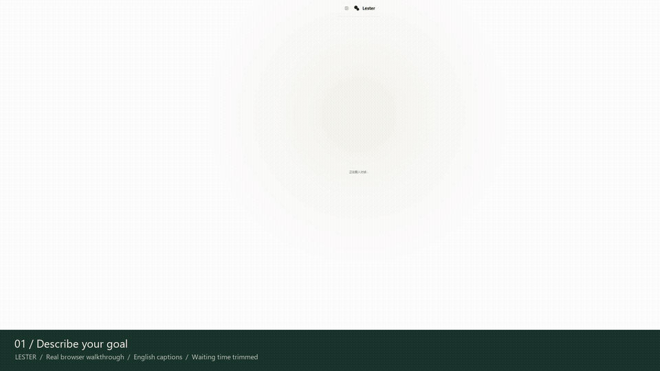
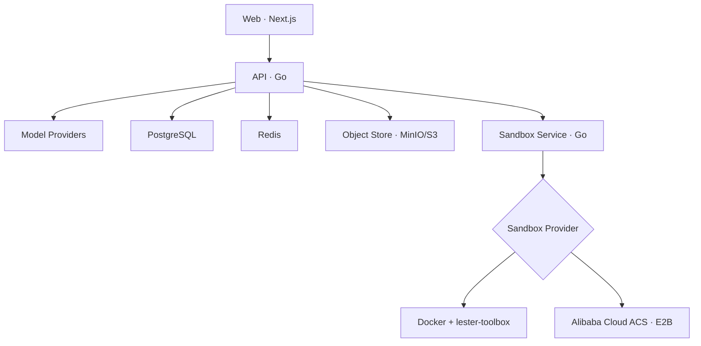

# Lester

**An open-source, self-hostable AI agent workspace.**

Describe a goal, choose a model, and let Lester work with files and commands in your personal Computer. Preview the results beside the conversation and ask for changes without leaving the workspace.

[Quick start](#quick-start) · [Walkthrough](#watch-the-walkthrough) · [Architecture](#architecture) · [Deployment](#deployment) · [Chinese reference](README.zh-CN.md)

## Watch the walkthrough

[](docs/media/lester-walkthrough.mp4)

**[Watch or download the full MP4 — 65 seconds](docs/media/lester-walkthrough.mp4)** · [Still preview](docs/media/lester-walkthrough.png)

Recorded in the real local application with English instructional captions and no voiceover. The application UI is currently Chinese. Waiting time between operations is trimmed; generation and edits are real model runs. The animated preview plays directly in this README. Select it to open the video file, or use the MP4 link if your Markdown viewer does not support inline video playback.

| Time | Operation |
| --- | --- |
| 00:00 | Describe a coffee landing page in the home composer |
| 00:06 | Send the task and watch Lester create the HTML file |
| 00:22 | Open the generated file card and resize the preview panel |
| 00:28 | Switch between rendered HTML and source code |
| 00:34 | Test the page's light/dark theme toggle |
| 00:38 | Reference the file and request a headline change and storage fallback |
| 00:55 | See the updated preview and test the toggle again |

The recording starts in a signed-in workspace with a model already configured. Follow the setup below for a fresh installation.

## Quick start

### Prerequisites

- Docker and Docker Compose v2
- Credentials for a supported model provider

### 1. Configure a fresh installation

```bash
cp deploy/.env.example deploy/.env
```

Fill in `POSTGRES_PASSWORD`, `MASTER_KEY_BASE64`, `SANDBOX_SERVICE_TOKEN`, and `MINIO_ROOT_PASSWORD`. The example intentionally contains no usable passwords or keys. Generate independent values with:

```bash
openssl rand -hex 24       # POSTGRES_PASSWORD
openssl rand -base64 32    # MASTER_KEY_BASE64
openssl rand -hex 32       # SANDBOX_SERVICE_TOKEN
openssl rand -hex 24       # MINIO_ROOT_PASSWORD
```

For an existing installation, preserve your current `.env`, encryption key, and persistent volumes. Do not overwrite them with the example.

### 2. Start Lester

Run from the repository root:

```bash
docker compose --env-file deploy/.env \
  -f deploy/docker-compose.yaml \
  up -d --build
```

PowerShell equivalent:

```powershell
docker compose --env-file deploy/.env -f deploy/docker-compose.yaml up -d --build
```

To restart an existing installation without rebuilding, omit `--build`.

### 3. Start your first conversation

1. Open [http://localhost:13000](http://localhost:13000).
2. Register and sign in. Lester creates your Personal Workspace automatically.
3. Open the lower-left account menu, then **Settings → Models**, and configure a provider and default model.
4. Type a goal in the home composer. Sending the first message creates the conversation and starts the task.
5. Open a resulting file card to preview its contents, inspect source, download it, or reference it in a follow-up message.

If the default port is occupied or reserved by Windows, choose an available port and update **both** settings in `deploy/.env`:

```dotenv
GATEWAY_PORT=13180
WEB_ORIGIN=http://localhost:13180
```

Restart Compose and open [http://localhost:13180/app](http://localhost:13180/app). This is the local address used in the recording; the repository default remains port `13000`.

Check service status with:

```bash
docker compose --env-file deploy/.env -f deploy/docker-compose.yaml ps
```

## Features

- **Bring your own model.** Configure workspace-level providers and encrypted credentials for OpenAI, Anthropic, Azure OpenAI, OpenAI-compatible services, AWS Bedrock, Google Vertex AI, and Microsoft Foundry.
- **Start from a goal.** The centered composer supports model selection, attachments, and pasted images. New conversation returns to the composer without creating an empty conversation. New conversations use Lester; older conversations retain their original persona.
- **Follow work live.** Replies and actual tool activity stream through one workspace-level SSE connection. Elapsed time, stop controls, and one-time unread notifications show progress across conversations. Runs continue until completion, an explicit error, or cancellation, without a fixed model/tool-loop limit.
- **Use a personal Computer.** Each user gets one logical Computer backed by Docker or Alibaba Cloud ACS Agent Sandbox. Each conversation has its own working directory for commands, files, and terminal sessions. Idle Computers suspend and resume on demand.
- **Inspect and refine files.** Browse a directory tree, open up to eight tabs, inspect code with line numbers, and preview text, Markdown, images, PDFs, or HTML. HTML runs in a restricted iframe with source switching and a separate-page preview. Download files or reference them with Modify; references pass paths, not automatically injected contents.
- **Keep your place.** Resize the desktop Computer panel, collapse the conversation rail, search conversation titles, and focus previews. Narrow screens have a dedicated file panel. Reading history does not force-scroll to new output; a jump control takes you back when ready.
- **Continue across navigation.** Drafts, file references, tabs, preview modes, expanded directories, and transcript/source reading positions are restored within the current browser tab. File updates do not steal selected tabs or reset source reading positions.
- **Add conversation Skills.** Install packages from the Skill marketplace into a conversation, then let the agent load their instructions when needed.
- **Manage your profile.** The account menu groups profile, model, Computer, and Skill settings. Display names and built-in avatar themes persist.

Task-file cards appear after a run finishes, fails, or stops, and only reference files confirmed to exist. The right-hand file inventory and previews keep updating during execution. You can draft the next message during a run, but cannot send overlapping runs in the same conversation.

### File synchronization and view state

File and tool/run events invalidate the shared inventory. While the page is visible, metadata polling runs every 5 seconds during execution and every 15 seconds while idle to detect Bash and background-script changes. Automatic scans cover up to 64 directories, 2,000 files, and five nested levels. Dependencies, caches, and `.agent` are skipped by default but can be expanded manually; partial scans are disclosed.

The changes list combines persisted file events from the current run with changes observed while the view is open. It is not a complete history, content diff, or checkpoint system. Metadata checks cannot detect changed contents with identical size and modification time.

View state is scoped by user, workspace, and conversation in tab-local `sessionStorage`, bounded to 50 conversations and 100,000 draft characters, and cleared at logout. Local attachments survive client navigation in memory only; after reload, the UI asks you to select them again. File contents are never saved in browser storage. HTML refreshes may reset the generated page's own interaction state; iframe permissions are not relaxed to preserve it.

### Product scope

Lester focuses on conversation-driven work. The current version does not include a Workflow/DAG editor or engine, visual orchestration, a multi-agent orchestration UI, Knowledge Base/RAG products, Memory, browser automation, Artifact persistence, Computer snapshots, or automatic Docker/ACS workspace migration.

## Architecture



Web, API, and Sandbox Service build and run separately. Sandbox Service owns Computer lifecycle, commands, files, and interactive terminals behind a common provider interface. Higher layers store an opaque `provider_ref` without depending on Docker container names or ACS Sandbox IDs.

Only Sandbox Service mounts the Docker socket in Docker mode and installs the static Go `lester-toolbox` helper into Computers. ACS uses the official OpenKruise Go E2B SDK without mounting the Docker socket. Private Sandbox Service endpoints require an internal bearer token; only its health check is unauthenticated. API accesses Skill packages through an object-store interface backed by S3-compatible MinIO in Compose.

| Service | Default host → container port | Purpose |
| --- | --- | --- |
| Nginx gateway | `13000 → 8080`, configurable | Single same-origin entry point |
| Web | Internal `3000` only | User interface |
| API | Internal `8080` only | Authentication, models, conversations, agent runtime |
| Sandbox Service | Internal `8090` only | Computer lifecycle, commands, files, terminals |
| PostgreSQL | Internal `5432` only | Durable business data |
| Redis | Internal `6379` only | Live SSE distribution |
| MinIO | Internal `9000` / `9001` only | S3-compatible Skill package storage |

## Computers and sandboxes

Lester uses **one persistent Computer per user and one working directory per conversation**:

```text
User
└── Computer workspace mounted at /workspace
    └── conversations/
        ├── {conversationId-A}/
        ├── {conversationId-B}/
        └── {conversationId-C}/
```

Docker provides a per-user container and persistent volume; ACS provides a cloud Sandbox. Commands and terminals start in `/workspace/conversations/{conversationId}`, and file APIs enforce conversation boundaries. Paths are normalized and checked server-side. Docker's helper also validates resolved paths and symbolic links inside the container and provides atomic writes; ACS implements the same provider contract through runtime file APIs. File tools cannot access other conversation directories or arbitrary container paths such as `/tmp`.

Before use, API reconciles the provider's actual state, creates missing resources, resumes stopped/paused Computers, and prepares the conversation directory. Creation and recovery use a PostgreSQL per-user advisory transaction lock to prevent duplicate Computers across API replicas. Background reconciliation runs every 30 seconds by default; suspension follows 30 idle minutes.

Recreating a Docker container does not deliberately delete the user's volume. ACS preserves its workspace through pause/resume. Recovery from destroyed cloud Sandboxes, snapshots, and cross-provider migration are not provided.

### Runtime limits

| Setting | Default or limit |
| --- | --- |
| Docker sandbox image | `python:3.12-slim` |
| Docker network | Disabled |
| Docker resources | 2 CPUs, 4 GB RAM, 256 PIDs, `no-new-privileges` |
| File operations | 25 MiB |
| Vision image read | 8 MiB per image |
| Foreground Bash timeout | 120 seconds; configurable up to 600 |
| Command stdout / stderr | Independently capped at 256 KiB |
| Model-visible tool result | Approximately 30,000 characters |

`bash` accepts `run_in_background: true`, immediately returning a task ID, PID, and `.lester/tasks/{taskId}.log`. Read the log to inspect progress. Starting a background process does not prove it succeeded.

Command truncation retains the beginning and end with omitted-byte counts. Text `read` streams a contiguous line range, returning one-based right-aligned line numbers, a tab, and original text, such as `"     1\tport: 8080"`. Use `offset`, `limit`, and `next_offset` to page; lines over 2,000 characters are explicitly truncated. Do not include added line-number prefixes in edits. Image reads return bounded `images[]` envelopes that integrations translate to native vision parts, not text containing base64.

ACS supports `native` and `private` routing. Native is the production default and requires wildcard DNS/TLS. Private uses a single domain with `/kruise` for internal/test access. Creation defaults to `secure` and `autoPause`; connection tokens are not stored in Lester's database.

## Conversation storage and context

PostgreSQL is the durable source of truth; Redis provides live delivery.

- `messages` stores user input, intermediate/final assistant messages, tool calls, and model-visible results, including truncation notices. `run_id` links execution and `tool_call_id` pairs calls/results. History restores by database-generated `messages.seq`, not timestamps or UUIDs.
- `runs` snapshots the triggering message, system prompt, tools, model ID, output settings, and initial history boundary (`history_through_seq`), excluding provider secrets.
- `run_events` drives activity displays without replacing the transcript. Each browser workspace keeps one authenticated SSE connection. Opening a conversation loads the latest 1,200 durable events; a persisted tab-local cursor and event-ID deduplication support refresh recovery.
- Stopping persists `running → cancelling → cancelled`, cancels streams and foreground tools, and emits `RUN_CANCELLED`. Unresolved tool calls receive cancelled/unknown results. Existing side effects are not rolled back.
- One run executes per conversation. Overlapping sends return HTTP 409 before inserting a message; different conversations can run concurrently. Each run holds an extra database session for its advisory lock: use direct connections or session pooling, not transaction pooling.
- After interruption, the next send marks abandoned runs failed and fills missing tool results with interrupted/unknown outcomes. Tools are never automatically replayed. Partial streams remain incomplete audit records outside complete model history.
- Default conversation responses show user/final assistant messages. Authenticated `GET /api/v1/conversations/{id}?include_internal=true` returns the full ordered transcript within normal workspace permissions.

### Tool-context working set

Before every model iteration, the runtime derives a read-only projection of complete history without rewriting stored messages or UI history.

| State | Default rule | Model input |
| --- | --- | --- |
| FULL | Latest 10 individual ToolExchanges and the entire latest unobserved batch | Original arguments and complete model-visible results |
| REFERENCE | Older reads, edits, writes, ordinary successful Bash calls, background tasks | Historical execution/file/range/command/exit-code/task-log references |
| EVICTED | Consumed low-value successes from an exact allowlist | Call/result pair omitted; assistant prose retained |

Calls and results are paired atomically, even in mixed batches. Failures are pinned as FULL until a verified matching success occurs in a later batch. Bash requires the same command and foreground/background mode; reads require the same path; other tools require equivalent JSON arguments. Conversational claims, same-batch successes, and background launches do not release failure pins.

Compound commands and redirected commands are not treated as allowlisted bare commands. `load_skill`, unknown tools, and unrecognized results stay FULL conservatively. References are marked historical data, not executable tool arguments. `tool_execution_id` is `run_id:tool_call_id`; background references keep `task_id` and `log_path`. Re-reading sees current files, not a historical snapshot; do not replay side effects to reconstruct output.

`MODEL_STARTED.payload.tool_context` reports policy version, FULL/REFERENCE/EVICTED/PIN counts, and before/after character counts, not exact token usage. `runs.context` stores the policy version and window size. This policy requires existing migration 004 but no extra migration. It does not add summaries, automatic compaction, Memory, RAG, or a total context budget; prose, references, and unresolved failures may still grow.

### Upgrading an existing database

PostgreSQL initialization mounts run only for fresh data directories. Back up existing databases, stop API writes, confirm migrations 001–003, and apply each missing migration once. This Bash example assumes 004 and 005 are both missing:

```bash
docker compose --env-file deploy/.env -f deploy/docker-compose.yaml stop api
docker compose --env-file deploy/.env -f deploy/docker-compose.yaml exec -T postgres \
  sh -c 'psql -v ON_ERROR_STOP=1 --single-transaction -U "$POSTGRES_USER" -d "$POSTGRES_DB"' \
  < backend/migrations/000004_durable_transcript.up.sql
docker compose --env-file deploy/.env -f deploy/docker-compose.yaml exec -T postgres \
  sh -c 'psql -v ON_ERROR_STOP=1 --single-transaction -U "$POSTGRES_USER" -d "$POSTGRES_DB"' \
  < backend/migrations/000005_user_profiles.up.sql
docker compose --env-file deploy/.env -f deploy/docker-compose.yaml up -d --build api
```

Fresh installs apply 004–005 automatically. Migration 004 preserves old chat order but cannot recover tool results older versions never stored; 005 adds built-in profile avatars. Rollback SQL retains message text, but older API versions do not understand new tool messages. Use a backup for a full downgrade.

## Skills and attachments

Skill metadata lives in PostgreSQL and versioned packages in object storage. `backend/internal/blob.Store` is the storage boundary, currently backed by MinIO and replaceable with S3 or another implementation. Startup seeds Code Review, Project Planner, and Data Explorer.

Installation extracts packages into `/workspace/conversations/{conversationId}/.agent/skills/{slug}` and records the relationship. Prompts list installed names, descriptions, and paths only. The agent must call `load_skill` to read `SKILL.md` before use. Uninstalling affects the current conversation only.

Uploads and pasted images are stored in `/workspace/conversations/{conversationId}/.agent/upload`. Messages retain metadata and pass file paths, original names, types, and sizes to the model. Contents are not automatically parsed or injected; the agent reads them when needed.

## Deployment

### Same-origin gateway

Compose proxies `/api` and `/api/*` to API without rewriting paths; other traffic goes to Web. Cookies, SSE, terminal WebSockets, uploads, and HTML previews share one browser origin. The gateway does not implement business authentication, read user files, or expose Sandbox Service. API authenticates previews and provides their CSP.

- Keep `WEB_ORIGIN` aligned with the real public scheme, hostname, and port, or terminal Origin checks reject connections.
- Compose builds Web with an empty `NEXT_PUBLIC_API_URL`. Older `.env` values no longer override it. Rebuild Web after upgrading; runtime environment changes cannot alter bundled browser code. Standalone frontend development can still specify an API origin.
- SSE buffering/cache are disabled; terminal WebSocket Upgrade is supported. The API timeout is one hour of **idle time**, not an agent run limit. Heartbeats keep SSE alive; failed API requests are not replayed automatically.
- Gateway request bodies allow 26 MiB, including multipart overhead; API retains a 25 MiB per-file limit. `/healthz` is gateway liveness only, not upstream readiness.
- For temporary debugging, append `-f deploy/docker-compose.debug.yaml` or use `make dev-debug`. API `18080` and MinIO `9000/9001` bind only to `127.0.0.1`; browsers still use the gateway. Reapply default Compose afterward to remove debug bindings.
- Public deployments should use HTTPS and `SESSION_COOKIE_SECURE=true`. Configure gateway TLS or a trusted external load balancer. With external TLS termination, restrict gateway access to that proxy and forward the public scheme correctly. The supplied gateway overwrites incoming `X-Forwarded-Proto` with its own scheme; do not trust arbitrary public forwarding headers.

Gateway upgrades require no new database migration. Preserve `.env` and volumes, update `WEB_ORIGIN`, and run the full `docker compose ... up -d --build`. Remove old Web/API port overrides and configure public ports on the gateway.

Run the isolated proxy suite, which uses no application data or host ports:

```bash
make gateway-check
# Clean up test containers after a failed run; application volumes are unaffected:
docker compose -p lester-gateway-test -f deploy/gateway/compose.test.yaml down
```

It covers routes/escaped paths, cookies/headers, preview CSP, 25 MiB uploads, initial SSE delivery, and bidirectional WebSockets. CI runs the same checks.

### Kubernetes and Helm

`deploy/helm/lester` deploys Web, API, Sandbox Service, ClusterIP services, optional Ingress, and NetworkPolicy. Provide external PostgreSQL, Redis, and S3-compatible storage. Apply `backend/migrations/*.up.sql` in numeric order before installation.

Build and push separate Web, API, and Sandbox Service images. For ACS, also supply a compatible runtime image; the included one provides Bash, Python, Node.js, Git, ripgrep, and `lester-toolbox`:

```bash
docker build -f backend/Dockerfile.sandbox-runtime -t registry.example.com/lester-sandbox-runtime:v1 backend
docker push registry.example.com/lester-sandbox-runtime:v1
```

Create private values without committing real secrets:

```yaml
images:
  api: {repository: registry.example.com/lester-api, tag: v0.1.0}
  web: {repository: registry.example.com/lester-web, tag: v0.1.0}
  sandboxService: {repository: registry.example.com/lester-sandbox-service, tag: v0.1.0}

config:
  webOrigin: https://lester.example.com
  objectStore: {endpoint: s3.example.com, bucket: lester-skills, useSSL: true}

secrets:
  databaseURL: postgres://...
  redisURL: redis://...
  masterKeyBase64: ...
  sandboxServiceToken: ...
  objectStoreAccessKey: ...
  objectStoreSecretKey: ...

ingress:
  enabled: true
  className: nginx
  host: lester.example.com
  tls:
    - secretName: lester-tls
      hosts: [lester.example.com]

sandbox:
  provider: docker
  nodeSelector: {lester.dev/docker-worker: "true"}
```

```bash
helm upgrade --install lester deploy/helm/lester \
  --namespace lester --create-namespace \
  -f values.production.yaml
```

Ingress routes `/api` to API and other paths to Web, without an extra Compose gateway pod or `NEXT_PUBLIC_API_URL`. Configure your controller for unbuffered SSE, WebSockets, suitable idle timeouts/upload sizes, and external scheme forwarding. These settings are controller-specific.

Docker is the default provider. Sandbox Service runs as one replica on a dedicated worker selected by `sandbox.nodeSelector`, with `/var/run/docker.sock`. Socket access grants extensive node privileges, is incompatible with Restricted Pod Security, and keeps user volumes node-local.

For ACS Agent Sandbox:

```yaml
secrets:
  # Must match ack-sandbox-manager's adminApiKey.
  acsSandboxAPIKey: ...

sandbox:
  provider: acs
  replicas: 2
  acs:
    domain: sandbox.example.com
    protocol: native # Production default; private is for internal/test access.
    template: lester-agent
    secure: true
    autoPause: true
    sandboxSet:
      enabled: true
      replicas: 4
      image: registry.example.com/lester-sandbox-runtime:v1
```

ACS mode does not mount the Docker socket and allows multiple stateless Sandbox Service replicas. The chart can create a warm-pool `SandboxSet` named after `sandbox.acs.template`, or use an existing template with `sandboxSet.enabled=false`. The included image uses an unprivileged `sandbox` user and provides the required `/bin/bash`, `cp`, `mv`, and `mkdir`.

Install or upgrade `ack-agent-sandbox-controller` and `ack-sandbox-manager`, then configure DNS, TLS, and the API key using the [Alibaba Cloud E2B integration documentation](https://help.aliyun.com/zh/cs/user-guide/connect-to-agent-sandbox-using-the-e2b-sdk). Native needs wildcard DNS/TLS; Private uses a single domain with `/kruise`.

For `secrets.existingSecret`, provide `DATABASE_URL`, `REDIS_URL`, `MASTER_KEY_BASE64`, `SANDBOX_SERVICE_TOKEN`, `OBJECT_STORE_ACCESS_KEY`, and `OBJECT_STORE_SECRET_KEY`, plus `ACS_SANDBOX_API_KEY` for ACS. Switching providers creates a new Computer without migrating old files. Back up or migrate workspaces separately before switching.

## Repository layout

```text
lester-agent/
├── frontend/                     Next.js application
│   ├── src/
│   └── Dockerfile
├── backend/                      Go application
│   ├── cmd/api/                  API entry point
│   ├── cmd/sandbox-service/      Sandbox Service entry point
│   ├── cmd/lester-toolbox/       Static Computer filesystem helper
│   ├── internal/
│   │   ├── agenttool/            Tool registry and independent handlers
│   │   ├── toolboxfs/            Safe filesystem operations and protocol
│   │   └── model/                Model storage, contracts, and providers
│   ├── prompts/                  Embedded system prompts
│   ├── migrations/               PostgreSQL migrations
│   ├── Dockerfile.api
│   ├── Dockerfile.sandbox-runtime
│   └── Dockerfile.sandbox-service
├── deploy/                       Compose, environment templates, Helm
├── docs/media/                   Walkthrough video, animation, and poster
├── AGENTS.md                     Coding-agent development agreement
├── Makefile
├── README.zh-CN.md               Original Chinese technical reference
└── README.md
```

Frontend and backend have separate dependencies, build contexts, and Dockerfiles. API and Sandbox Service share the Go module but compile into separate executables and containers. Tools extend a registry through independent schemas/handlers; model providers register through `internal/model/integration.Provider`. Stores and conversation runtime do not contain provider-specific branches. See [backend architecture](backend/ARCHITECTURE.md) for extension boundaries.

The runtime imposes no global model output-token cap. OpenAI-compatible providers omit `max_tokens` when unset. Protocols that require a limit, including Anthropic, Vertex Anthropic, and Bedrock Anthropic, use adapter-specific fallbacks.

## Development checks

Backend (Go 1.25):

```bash
cd backend
go mod tidy
go test ./...
```

Frontend (pnpm 10.17.1):

```bash
cd frontend
pnpm install --frozen-lockfile
pnpm lint
pnpm build
```

Or from the repository root:

```bash
make test
make web-check
```

After frontend changes, rebuild the running Web service and reload the browser:

```bash
docker compose --env-file deploy/.env -f deploy/docker-compose.yaml up -d --no-deps --build web
```

For Helm changes:

```bash
helm lint deploy/helm/lester --set secrets.existingSecret=lester-test-secrets
helm template lester deploy/helm/lester --set secrets.existingSecret=lester-test-secrets
```

## Security notes

- Generate your own `MASTER_KEY_BASE64` and `SANDBOX_SERVICE_TOKEN`. Keep real secrets and local `.env` files out of Git.
- Model-provider credentials are encrypted at rest with AES-GCM.
- HTTPS deployments use Secure session cookies by default; sign-in and registration are rate-limited per client IP.
- Keep Sandbox Service private and Docker socket access on an isolated, dedicated worker.
- User Computers default to disabled networking and CPU, memory, and PID limits.
- File APIs and terminal working directories are conversation-scoped. HTML preview authentication, CSP, and iframe restrictions remain in force for generated pages.
