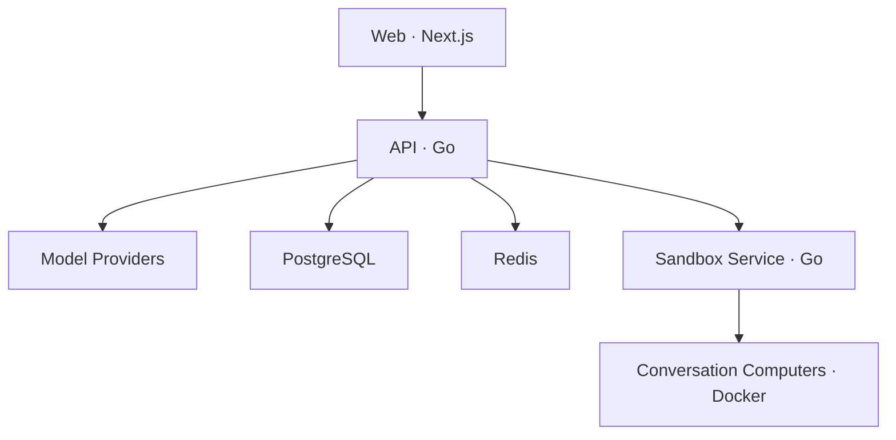

# Lester

**Lester 是一个开源、可自部署的 AI Agent Workspace。**

它以对话为主要入口：用户创建对话、选择 Agent 和模型，然后让 Agent 使用该对话专属的 Computer 完成任务。

> Lester 不是 Workflow/DAG 编排平台，不提供拖拽节点、条件分支或流程画布。

## Lester 能做什么

- 使用邮箱和密码注册、登录，自动创建个人 Workspace
- 在 Workspace 中配置自己的模型 Provider 和密钥
- 支持 OpenAI、Anthropic、Azure OpenAI、OpenAI-compatible、AWS Bedrock、Google Vertex AI 和 Microsoft Foundry
- 通过 SSE 实时输出 Agent 回复，并持久化对话、消息、运行记录和事件
- 创建对话时选择 Lester、Franklin、Michael 或 Trevor；同一对话内角色保持不变
- 为每个对话分配独立的 Docker Computer
- Agent 可以在 Computer 中执行命令、读写文件和使用终端
- Computer 工作目录使用独立 Docker Volume 持久化，空闲后自动暂停并在下次访问时恢复

## 当前不包含

为保持产品聚焦，当前版本不包含以下能力：

- Workflow/DAG 编辑器与执行引擎
- 可视化流程编排
- 多 Agent 编排界面
- Knowledge Base/RAG 产品
- Memory
- 浏览器自动化
- Skill 安装与 Skill 广场
- 文件上传、Artifact 持久化和 Computer 快照
- Kubernetes、Helm 和 E2B Sandbox

界面中的 Skills 入口目前仅用于展示产品方向，不具备安装或执行能力。

## 系统结构



Web、API 和 Sandbox Service 分别构建和运行在独立容器中。只有 Sandbox Service 挂载 Docker Socket，并负责创建和管理对话 Computer。

| 服务 | 默认端口 | 用途 |
| --- | ---: | --- |
| Web | `3000` | 用户界面 |
| API | `8080` | 登录、模型配置、对话和 Agent Runtime |
| Sandbox Service | `8090` | Computer 生命周期、命令、文件和终端 |
| PostgreSQL | `5432` | 持久化业务数据 |
| Redis | `6379` | SSE 事件分发 |
| MinIO | `9000` / `9001` | 预留对象存储服务，当前功能暂未使用 |

## 快速启动

### 环境要求

- Docker
- Docker Compose v2

### 1. 准备配置

```bash
cp deploy/.env.example deploy/.env
```

`deploy/.env.example` 中的 `MASTER_KEY_BASE64` 仅供本地开发。非本地环境请生成新的 32 字节密钥：

```bash
openssl rand -base64 32
```

### 2. 启动 Lester

```bash
docker compose --env-file deploy/.env \
  -f deploy/docker-compose.yaml \
  up --build
```

### 3. 开始使用

1. 打开 <http://localhost:3000>
2. 注册账号并登录
3. 前往 **Settings → Models** 配置模型 Provider
4. 创建对话并选择 Agent

## 仓库结构

```text
lester-agent/
├── frontend/                     Next.js 前端工程
│   ├── src/
│   └── Dockerfile
├── backend/                      Go 后端工程
│   ├── cmd/api/                  API 服务入口
│   ├── cmd/sandbox-service/      Sandbox 服务入口
│   ├── internal/                 后端内部实现
│   ├── prompts/                  Agent 系统 Prompt
│   ├── migrations/               PostgreSQL 迁移
│   ├── Dockerfile.api
│   └── Dockerfile.sandbox-service
├── deploy/                       Docker Compose 与环境配置
├── Makefile
└── README.md
```

这是一个 Monorepo，但前端和后端拥有独立的依赖、构建上下文与 Dockerfile。API 和 Sandbox Service 同属 Go 后端工程，但会编译成两个可执行程序并运行在两个容器中。

## 开发检查

后端：

```bash
cd backend
go mod tidy
go test ./...
```

前端：

```bash
cd frontend
pnpm install --frozen-lockfile
pnpm lint
pnpm build
```

也可以在仓库根目录执行：

```bash
make test
make web-check
```

## 安全提示

- 不要在生产环境使用示例 `MASTER_KEY_BASE64`
- Provider 密钥使用 AES-GCM 加密后存储
- Sandbox Service 拥有 Docker Socket 权限，生产部署时应运行在隔离的专用 Worker
- Conversation Computer 默认禁用网络，并限制 CPU、内存和 PID 数量
