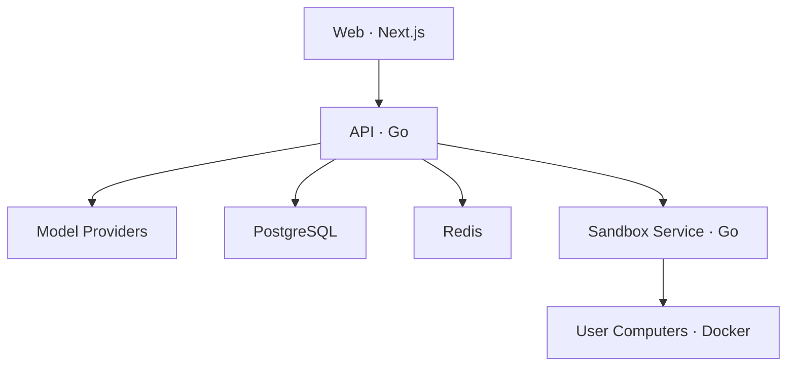

# Lester

**Lester 是一个开源、可自部署的 AI Agent Workspace。**

它以对话为主要入口：用户创建对话、选择 Agent 和模型，然后让 Agent 在用户专属 Computer 的独立会话目录中完成任务。

> Lester 不是 Workflow/DAG 编排平台，不提供拖拽节点、条件分支或流程画布。

## Lester 能做什么

- 使用邮箱和密码注册、登录，自动创建个人 Workspace
- 在 Workspace 中配置自己的模型 Provider 和密钥
- 支持 OpenAI、Anthropic、Azure OpenAI、OpenAI-compatible、AWS Bedrock、Google Vertex AI 和 Microsoft Foundry
- 通过 SSE 实时输出 Agent 回复，并持久化对话、消息、运行记录和事件
- 创建对话时选择 Lester、Franklin、Michael 或 Trevor；同一对话内角色保持不变
- 为每个用户分配一个持久化 Docker Computer，并以 `/workspace/conversations/{conversationId}` 隔离会话目录
- Agent 可以在 Computer 中执行命令、读写文件和使用终端
- Computer 工作目录使用用户级 Docker Volume 持久化，空闲后自动暂停并在下次访问时恢复；服务会持续校验其真实运行状态

## 当前不包含

为保持产品聚焦，当前版本不包含以下能力：

- Workflow/DAG 编辑器与执行引擎
- 可视化流程编排
- 多 Agent 编排界面
- Knowledge Base/RAG 产品
- Memory
- 浏览器自动化
- Skill 安装与 Skill 广场
- 文件上传、Artifact 持久化和 Computer 快照
- Kubernetes、Helm 和 E2B Sandbox

界面中的 Skills 入口目前仅用于展示产品方向，不具备安装或执行能力。

## 系统结构



Web、API 和 Sandbox Service 分别构建和运行在独立容器中。只有 Sandbox Service 挂载 Docker Socket，并负责创建、监控和管理用户 Computer。

## 沙箱机制

Lester 采用“**每个用户一个持久化 Computer，每个会话一个独立目录**”的模型。这样既不会随着会话数量增加而创建大量容器，又能保持会话之间的文件边界。

```text
User
└── Docker Computer + persistent volume mounted at /workspace
    └── conversations/
        ├── {conversationId-A}/
        ├── {conversationId-B}/
        └── {conversationId-C}/
```

### 隔离边界

- 一个用户只对应一个 Docker Computer 和一个持久化 Docker Volume。
- 每个会话固定使用 `/workspace/conversations/{conversationId}` 作为工作目录。
- Agent 的 `bash`、`read`、`write`、`edit` 工具，以及右侧 Files 和 Terminal，都由服务端强制限定在当前会话目录。
- 文件路径在服务端进行规范化和越界检查；其他会话目录和 `/tmp` 等容器路径不能通过文件工具访问。
- `computer_list_files` 不作为 Agent 工具暴露；Agent 使用 `bash` 配合 `ls`、`find` 或 `rg --files` 查找文件。

### 生命周期与故障恢复

每次使用 Computer 前，API 都会通过 Sandbox Service 核对 Docker 的真实状态，而不是只相信数据库中的状态：

1. Computer 不存在时，使用原有用户 Volume 创建新容器。
2. Computer 已停止或暂停时，自动恢复运行。
3. Computer 状态异常时，重建容器并继续挂载原有 Volume。
4. Computer 正常后，自动创建当前会话目录并将命令、文件和终端操作切换到该目录。
5. 后台监控默认每 30 秒同步一次容器状态；默认空闲 30 分钟后暂停，下次使用时自动恢复。

删除或重建容器不会主动删除用户 Volume，因此会话文件可继续恢复。数据库迁移也保留旧会话沙箱 Volume，便于需要时回滚。

### 资源与后台任务

默认 Docker Sandbox 使用 `python:3.12-slim`，禁用容器网络，并限制为 2 CPU、4 GB 内存和 256 个 PID，同时启用 `no-new-privileges`。

`bash` 支持 `run_in_background: true`。后台命令会立即返回任务 ID、PID 和 `.lester/tasks/{taskId}.log`，Agent 可以随后使用 `read` 查看日志。前台 Bash 默认超时 120 秒，最大可配置为 600 秒。

| 服务 | 本地端口 → 容器端口 | 用途 |
| --- | ---: | --- |
| Web | `13000 → 3000` | 用户界面 |
| API | `18080 → 8080` | 登录、模型配置、对话和 Agent Runtime |
| Sandbox Service | `18090 → 8090` | Computer 生命周期、命令、文件和终端 |
| PostgreSQL | `5432` | 持久化业务数据 |
| Redis | `6379` | SSE 事件分发 |
| MinIO | `9000` / `9001` | 预留对象存储服务，当前功能暂未使用 |

## 快速启动

### 环境要求

- Docker
- Docker Compose v2

### 1. 准备配置

```bash
cp deploy/.env.example deploy/.env
```

`deploy/.env.example` 中的 `MASTER_KEY_BASE64` 仅供本地开发。非本地环境请生成新的 32 字节密钥：

```bash
openssl rand -base64 32
```

### 2. 启动 Lester

```bash
docker compose --env-file deploy/.env \
  -f deploy/docker-compose.yaml \
  up --build
```

### 3. 开始使用

1. 打开 <http://localhost:13000>
2. 注册账号并登录
3. 前往 **Settings → Models** 配置模型 Provider
4. 创建对话并选择 Agent

## 仓库结构

```text
lester-agent/
├── frontend/                     Next.js 前端工程
│   ├── src/
│   └── Dockerfile
├── backend/                      Go 后端工程
│   ├── cmd/api/                  API 服务入口
│   ├── cmd/sandbox-service/      Sandbox 服务入口
│   ├── internal/                 后端内部实现
│   ├── prompts/                  Agent 系统 Prompt
│   ├── migrations/               PostgreSQL 迁移
│   ├── Dockerfile.api
│   └── Dockerfile.sandbox-service
├── deploy/                       Docker Compose 与环境配置
├── AGENTS.md                     编码 Agent 的开发约束
├── Makefile
└── README.md
```

这是一个 Monorepo，但前端和后端拥有独立的依赖、构建上下文与 Dockerfile。API 和 Sandbox Service 同属 Go 后端工程，但会编译成两个可执行程序并运行在两个容器中。

## 开发检查

后端：

```bash
cd backend
go mod tidy
go test ./...
```

前端：

```bash
cd frontend
pnpm install --frozen-lockfile
pnpm lint
pnpm build
```

也可以在仓库根目录执行：

```bash
make test
make web-check
```

## 安全提示

- 不要在生产环境使用示例 `MASTER_KEY_BASE64`
- Provider 密钥使用 AES-GCM 加密后存储
- Sandbox Service 拥有 Docker Socket 权限，生产部署时应运行在隔离的专用 Worker
- User Computer 默认禁用网络，并限制 CPU、内存和 PID 数量
- 文件 API 与终端默认进入 `/workspace/conversations/{conversationId}`，不会把其他会话目录展示为当前会话文件
