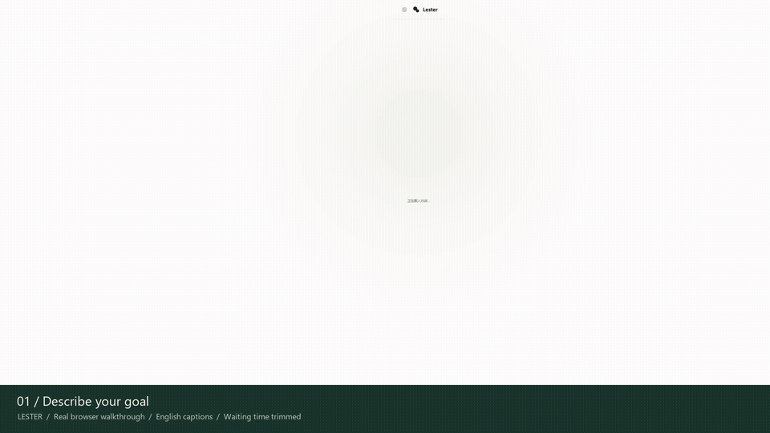
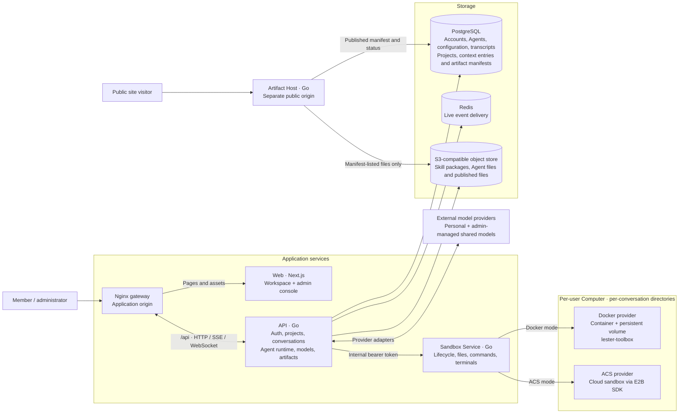
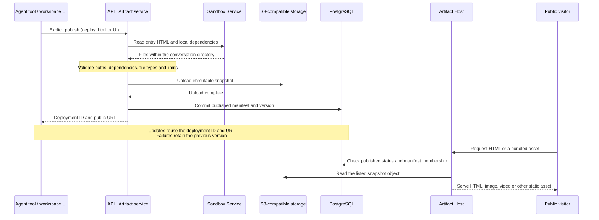

# Lester

**An open-source, self-hostable AI agent workspace.**

Describe a goal, choose a model, and let Lester work with files and commands in your personal Computer. Preview the results beside the conversation and ask for changes without leaving the workspace.

[Quick start](#quick-start) · [Walkthrough](#watch-the-walkthrough) · [Architecture](#architecture) · [Deployment](#deployment) · [Chinese reference](README.zh-CN.md)

## Public website and help

The deployment root `/` is Lester's minimal public homepage: the centered statement “想清楚。做出来。”, one primary action, a short introduction, and the story behind its name. Lester takes inspiration from GTA V's resourceful behind-the-scenes hacker, Lester Crest. Quiet navigation links to the workspace, documentation, actual GitHub repository and Issues. `/docs` provides help for quick start, everyday usage, model setup, deployment/upgrades, and troubleshooting. The homepage, complete help chapters, workspace, authentication, settings and step-by-step guides support Chinese, English, Japanese, Korean, French and Spanish. Public pages render on each request using the selected language and work without authentication or API access, including with JavaScript disabled. `/app` remains the conversation workspace; the login page and account menu link back to the website/help.

Documentation content lives in `frontend/src/lib/site-docs.tsx`; shared public-site components live in `frontend/src/components/site/`. Update the help content alongside changes to capabilities, environment variables, and migrations. Workspace entry uses the existing login flow and never starts a task automatically. Existing deployments must rebuild Web and reload the page. No additional database migration or deployment service is needed for the website.

The new-task screen keeps one 760px-wide composer, with quiet model/attachment controls and an on-demand Agent picker. Expand **试试一个任务** to choose an example; it only fills the draft. Desktop project/conversation action icons appear on hover or keyboard focus and stay visible on touch devices. Header help and artifact controls retain accessible names and tooltips; previews, terminal access, draft persistence and account tutorials remain available.

Language follows the browser preference on first visit, with English as the fallback for unsupported languages. Use the language selector in the public header, login page, account menu or settings sidebar to choose explicitly; a one-year cookie remembers the choice in that browser. The compact menu uses inline SVG flags, native language names and a checkmark; arrow keys, Home/End, Enter and Escape are supported. The shared SVG Lester mark also appears in the favicon. Switching language preserves drafts and local attachments during navigation. User messages, project/Agent names, model responses, file contents and deployment commands remain as authored.

## Step-by-step user guides

New accounts see a skippable seven-step introduction when they first enter `/app`. The **新手引导** entry in the workspace header/account menu and settings pages opens ten tutorials: first task, models, projects, files, Agents, context library, Computer, Skills, profile, and publishing. Feature pages show a dismissible first-use hint. Progress is stored per account and topic, so paused guides can resume on another device; completed guides can be replayed. Existing accounts are opted out of the automatic welcome during migration. Reading tutorials does not create tasks, call a model, install Skills, or publish files. Visiting model settings preserves the existing task draft.

Existing databases on 001–013 must apply **014 and 015 once** before rebuilding API and Web:

```bash
docker compose --env-file deploy/.env -f deploy/docker-compose.yaml stop api
docker compose --env-file deploy/.env -f deploy/docker-compose.yaml exec -T postgres \
  sh -c 'psql -v ON_ERROR_STOP=1 --single-transaction -U "$POSTGRES_USER" -d "$POSTGRES_DB"' \
  < backend/migrations/000014_user_guides.up.sql
docker compose --env-file deploy/.env -f deploy/docker-compose.yaml exec -T postgres \
  sh -c 'psql -v ON_ERROR_STOP=1 --single-transaction -U "$POSTGRES_USER" -d "$POSTGRES_DB"' \
  < backend/migrations/000015_rotating_tokens.up.sql
docker compose --env-file deploy/.env -f deploy/docker-compose.yaml up -d --build api web
```

Back up first, retain `.env`, encryption keys and volumes, and apply earlier missing migrations in order. Fresh Compose databases include 014 and 015 automatically; Helm deployments apply SQL externally. Rolling back 014 removes tutorial progress only and requires a compatible API/Web version. `GET /api/v1/me/guides` and `PATCH /api/v1/me/guides/{topic}` are authenticated and always scoped to the session user.

## Watch the walkthrough

[](docs/media/lester-walkthrough.mp4)

**[Watch or download the full MP4 — 65 seconds](docs/media/lester-walkthrough.mp4)** · [Still preview](docs/media/lester-walkthrough.png)

Recorded in the real local application with English instructional captions and no voiceover. The application UI is currently Chinese. Waiting time between operations is trimmed; generation and edits are real model runs. The animated preview plays directly in this README. Select it to open the video file, or use the MP4 link if your Markdown viewer does not support inline video playback.

| Time | Operation |
| --- | --- |
| 00:00 | Describe a coffee landing page in the home composer |
| 00:06 | Send the task and watch Lester create the HTML file |
| 00:22 | Open the generated file card and resize the preview panel |
| 00:28 | Switch between rendered HTML and source code |
| 00:34 | Test the page's light/dark theme toggle |
| 00:38 | Reference the file and request a headline change and storage fallback |
| 00:55 | See the updated preview and test the toggle again |

The recording starts in a signed-in workspace with a model already configured. Follow the setup below for a fresh installation.

## Quick start

### Prerequisites

- Docker and Docker Compose v2
- Credentials for a supported model provider

### 1. Configure a fresh installation

```bash
cp deploy/.env.example deploy/.env
```

Fill in `POSTGRES_PASSWORD`, `MASTER_KEY_BASE64`, `SANDBOX_SERVICE_TOKEN`, and `MINIO_ROOT_PASSWORD`. The example intentionally contains no usable passwords or keys. Generate independent values with:

```bash
openssl rand -hex 24       # POSTGRES_PASSWORD
openssl rand -base64 32    # MASTER_KEY_BASE64
openssl rand -hex 32       # SANDBOX_SERVICE_TOKEN
openssl rand -hex 24       # MINIO_ROOT_PASSWORD
```

For an existing installation, preserve your current `.env`, encryption key, and persistent volumes. Do not overwrite them with the example.

### 2. Start Lester

Run from the repository root:

```bash
docker compose --env-file deploy/.env \
  -f deploy/docker-compose.yaml \
  up -d --build
```

PowerShell equivalent:

```powershell
docker compose --env-file deploy/.env -f deploy/docker-compose.yaml up -d --build
```

To restart an existing installation without rebuilding, omit `--build`.

### 3. Start your first conversation

1. Open [http://localhost:13000](http://localhost:13000), then select **进入工作区** to enter `/app`.
2. Register and sign in. Lester creates your Personal Workspace automatically.
3. Select **配置第一个模型** on the home screen (or open **Settings → Models**). Save your provider connection, then add a Model ID. Connection and display names are optional; advanced endpoint/JSON configuration remains available. The first model is selected as your personal default unless you uncheck that option.
4. Type a goal in the home composer. Sending the first message creates the conversation and starts the task.
5. Open a resulting file card to preview its contents, inspect source, download it, or reference it in a follow-up message.

The setup page returns you to the original project with your message draft preserved. Saving configuration does not verify provider access; the first task confirms whether the model can be called. Home-screen task examples only fill the composer and never send automatically. On phones, the conversation's **…** menu contains model switching and published-artifact management, while **文件** opens the file panel. Assistant file names displayed as inline code can open the preview when they match a file in the current inventory.

If the default port is occupied or reserved by Windows, choose an available port and update **both** settings in `deploy/.env`:

```dotenv
GATEWAY_PORT=13180
WEB_ORIGIN=http://localhost:13180
```

Restart Compose and open [http://localhost:13180/app](http://localhost:13180/app). This is the local address used in the recording; the repository default remains port `13000`.

Check service status with:

```bash
docker compose --env-file deploy/.env -f deploy/docker-compose.yaml ps
```

## Features

- **Bring your own model.** Configure workspace-level providers and encrypted credentials for OpenAI, Anthropic, Azure OpenAI, OpenAI-compatible services, AWS Bedrock, Google Vertex AI, and Microsoft Foundry.
- **Start from a goal.** The centered composer supports model selection, attachments, and pasted images. New conversation returns to the composer without creating an empty conversation. New conversations use Lester; older conversations retain their original persona.
- **Follow work live.** Replies and actual tool activity stream through one workspace-level SSE connection. Elapsed time, stop controls, and one-time unread notifications show progress across conversations. Runs continue until completion, an explicit error, or cancellation, without a fixed model/tool-loop limit.
- **Use a personal Computer.** Each user gets one logical Computer backed by Docker or Alibaba Cloud ACS Agent Sandbox. Each conversation has its own working directory for commands, files, and terminal sessions. Idle Computers suspend and resume on demand.
- **Inspect and refine files.** Browse a directory tree, open up to eight tabs, inspect code with line numbers, and preview text, Markdown, images, PDFs, or HTML. HTML runs in a restricted iframe with source switching; local page links open verified files from the same conversation. Separate-page preview opens the same isolated viewer in a focused workspace, and direct HTML preview responses also enforce an opaque sandbox origin. Download files or reference them with Modify; references pass paths, not automatically injected contents.
- **Follow files as they are produced.** Successful Agent writes, edits and deliverable registration automatically open verified files in the right-side multi-tab viewer; observed inventory changes during a run also cover shell-generated files. Up to eight stable tabs reuse the same path and retain each file’s preview/source choice across refreshes. HTML defaults to the isolated iframe preview and can switch to source; genuine edits refresh even when size/mtime stay unchanged. Arrow keys and Home/End switch tabs; Delete closes the focused tab. Historical/replayed events, missing files, internal runtime files and dependencies do not force tabs open. On phones the file panel opens and can be dismissed to continue the conversation. Previewing never publishes files.
- **Work from deliverables.** After execution settles, HTML pages and Markdown documents from the verified conversation inventory appear together with preview, download, and file-specific **Continue modifying** actions. The Computer's **成果** tab and the phone's direct **成果** button open the same collection; **… → 查看会话文件** and the panel's **文件** tab retain access to other files. Compact cards keep pending-review status visible and expand file metadata, full summaries, downloads, and the explicit HTML deployment action under **详情与更多操作**. Clicking a card opens rendered preview and collapses the directory; ordinary file browsing and background updates retain directory visibility, and closing the final tab restores it. The `register_deliverable` tool records a real HTML/Markdown entry with a title, Agent-authored summary, source run, and entry SHA-256. Re-registering a path preserves its ID; each conversation supports up to 200 records. Registered entries appear first, joined with the verified current inventory; type-based discovery remains for older files and excludes dependency, hidden, Agent-resource, and common support documents such as README/AGENTS/SKILL. Explicit registration can designate a Markdown document as a deliverable. Missing files never become phantom cards. Registration and its digest do not prove validation, preserve historical contents, or publish anything; previews show current files. Other changed files remain in a collapsed related-files list. Partial synchronization and failed/stopped runs are disclosed.
- **Manage models on demand.** Personal settings show the saved model list when an enabled personal or shared model exists. **添加模型** opens the setup form; **服务商连接 → 添加连接** adds another provider. First setup still proceeds through connection and Model ID, and saving does not verify provider access. Administrator shared-model controls remain separate.
- **Keep your place.** Resize the desktop Computer panel, collapse the conversation rail, search conversation titles, and focus previews. Narrow screens have a dedicated file panel. Reading history does not force-scroll to new output; a jump control takes you back when ready.
- **Continue across navigation.** Drafts, file references, tabs, preview modes, expanded directories, and transcript/source reading positions are restored within the current browser tab. File updates do not steal selected tabs or reset source reading positions.
- **Add conversation Skills.** Install packages from the Skill marketplace into a conversation, then let the agent load their instructions when needed.
- **Organize projects.** Every workspace starts with a default project. Create and rename projects, pin projects and conversations, and move conversations between projects without moving their Computer files.
- **Publish HTML artifacts.** Deploy a single HTML file or a static directory, including local images and videos, to durable S3-compatible storage. Share a public URL and manage deployments on the dedicated Artifacts page.
- **Manage your profile.** The account menu groups profile, model, Computer, and Skill settings. Display names, uploaded avatars, built-in themes, linked Google/GitHub identities and passwords can be managed in **个人资料**.

The executor is separated from the conversation service but still runs inside API. Critical run transitions, events, and outbox intents commit atomically in PostgreSQL. Redis publication failures retain events for retries with stable IDs; clients deduplicate repeats. Graceful shutdown interrupts runs and releases their guards without replaying tools. An independent Worker and automatic task resumption are not implemented.

Task-file cards appear after a run finishes, fails, or stops, and only reference files confirmed to exist. The right-hand file inventory and previews keep updating during execution. You can draft the next message during a run, but cannot send overlapping runs in the same conversation.

### Projects and published artifacts

The sidebar shows a collapsible project/conversation tree. Each project has its own **+** button for starting a conversation and a menu for renaming or pinning. Project headings expand or collapse their conversations without navigating away. Each project initially shows five recent conversations; expand the history to see all, and the current conversation remains visible. Search displays matching conversations under their projects. Conversation menus support pinning and moving between projects. New drafts only become conversations when you send a message.

Open **Artifacts** from the independent link in the workspace header to enter its standalone page; **Return to workspace** takes you back to the originating conversation or project. Search deployments, filter by project, preview a published page in an isolated viewer, or open and copy its link. Each card’s more menu contains the source conversation, update, and take-offline actions. You can also deploy from an HTML file’s preview toolbar. Moving a conversation changes the project shown for its artifacts without changing their public URLs.

The agent has a built-in `deploy_html` tool, so no Skill installation is necessary. Ask it to publish explicitly, for example:

> Publish `website/` with `index.html` as the entry and give me a shareable link.

```json
{"name":"My website","source_path":"website","entry":"index.html"}
```

The tool returns both `artifact_id` and the legacy `id` alias. Pass the returned `artifact_id` as `artifact_id` on a later deployment to update the same deployment and keep its URL. A successful deployment is a snapshot: it survives Computer suspension and later file edits. Updating it is explicit. An upload or validation failure leaves the previous deployment available. Taking a deployment offline makes its entry and every asset return 404; it cannot recall copies already downloaded by viewers.

| Source | Deployment behavior |
| --- | --- |
| `report.html` | Collects the HTML and statically referenced local files |
| `website/` | Includes supported static files recursively; defaults to `index.html` |
| HTML with local media | Copies images, video, audio, fonts, CSS and JS into object storage and rewrites discovered paths |
| Sandbox absolute paths | Current conversation paths and explicitly referenced `.agent/upload` files are supported; other conversations and escaping paths are rejected |
| Inline / external media | Ordinary `data:` image/media URLs stay embedded; HTTP(S) URLs remain external and produce a warning |

Limits are **256 files, 256 directories, 12 directory levels, 25 MiB per file, and 100 MiB per deployment**. Missing local dependencies fail the deployment. Hidden files, dependency directories and executable/server files are excluded. Build React/Vue/framework projects into a static output directory first; the host does not execute backends or perform SPA fallback routing. Remove existing `<base>` tags. Use separate files instead of `data:` entries in `srcset`. Dynamic JavaScript URLs cannot be completely discovered; publish the complete directory and use relative paths. Static hosting uses a sandboxed document origin: cookies, localStorage, service workers and same-origin-only APIs are unavailable. Ordinary DOM interaction, scripts, images and range-based video playback are supported; external APIs must permit CORS.

#### Hosting configuration

Compose uses `ARTIFACT_PUBLIC_URL=http://127.0.0.1:13181` and `ARTIFACT_PORT=13181`. This loopback URL works on the host computer. For access from other devices or the Internet, configure a reachable hostname and TLS reverse proxy to Artifact Host, then set the same public origin on API and Artifact Host:

```dotenv
WEB_ORIGIN=https://lester.example.com
ARTIFACT_PUBLIC_URL=https://sites.example.net
ARTIFACT_PORT=13181
```

**Use a different hostname from the application**, preferably a separate registrable domain. A different port on the same hostname is rejected because cookies are not port-scoped. Do not proxy artifacts under the application origin or expose MinIO/Sandbox Service. Anyone with a published link can access it; deployment management remains authenticated and workspace-scoped. Artifact Host reads only published manifest entries, streams media with byte-range/HEAD support, sets `no-store`, and sends no authentication cookies. Keep reverse proxies/CDNs from overriding its cache and security headers.

The existing `OBJECT_STORE_*` configuration works with MinIO or an S3-compatible endpoint. Back up both PostgreSQL and the object bucket. Superseded object versions are retained to allow in-flight reads; there is currently no automatic storage garbage collection or version-restore UI. Unpublishing revokes access without deleting stored objects. Do not apply an age-only bucket expiration rule to `artifacts/`, as an old object may still belong to a live deployment.

For an existing installation, back up the database and apply migration 006 once before starting the updated API:

```bash
docker compose --env-file deploy/.env -f deploy/docker-compose.yaml stop api
cat backend/migrations/000006_projects_artifacts.up.sql | \
  docker compose --env-file deploy/.env -f deploy/docker-compose.yaml exec -T postgres \
  sh -c 'psql -v ON_ERROR_STOP=1 -1 -U "$POSTGRES_USER" -d "$POSTGRES_DB"'
docker compose --env-file deploy/.env -f deploy/docker-compose.yaml up -d --build
```

In PowerShell, replace `cat` with `Get-Content -Raw` and use a single line for the pipeline. Earlier migrations must already be applied. Fresh Compose volumes apply all migrations automatically. Do not delete volumes to upgrade.

### Context library and @ references

Open **Context library** from the account menu, or choose **Manage entries** in the chat context picker. Maintain personal dictionary-style entries with a name, short description, and plain-text or Markdown body. Entries are private to the current workspace, searchable by name and description, and can be edited or deleted. Version checks prevent stale edits from silently overwriting newer changes.

In either a new or existing conversation, type `@` followed by a name, or click **@ Reference context**. Use the arrow keys and Enter, or click a result. The picker floats outside the composer scroll container and adapts to the available viewport space; long lists scroll without hiding their controls. Escape or clicking outside dismisses it without sending a task. Selected entries appear as removable chips; then write your request and send. Reference selections survive navigation and refresh with the message draft. The library is a separate page, not a conversation tab.

The API resolves selected IDs within the authenticated workspace and saves the latest entry bodies and versions as immutable message metadata before starting the run. Historical messages show expandable snapshots, and model history uses those snapshots even after an entry is edited or deleted. Only explicitly selected entries are included; this feature does not add automatic retrieval, embeddings, or memory. Deleted or inaccessible references reject the send and preserve the draft.

Each entry supports an 80-character name, a 240-character description, and up to 20,000 characters of body text. A message can reference up to eight entries with a combined 40,000-character body limit. Names must be unique within a workspace.

For an existing installation, back up PostgreSQL, stop API writes, and apply `backend/migrations/000008_context_library.up.sql` once after migrations 001–007, using the same transactional `psql` procedure described below. Rebuild API and Web afterward. Fresh Compose volumes apply the migration automatically. Rolling back the library table does not remove snapshots already stored in messages.

### Custom Agents

Open **Agent management** from the account menu to see built-in and personal Agents. Each Agent has a landing page explaining its purpose and linking to a new conversation. In **Create Agent**, write a name, description and system instructions, then choose Skills from the catalog. The separate Agent creation assistant can discuss your goal and suggest an editable draft; applying its suggestion only fills the form, and saving remains an explicit action.

The new-conversation composer defaults to Lester and lets you choose another Agent before sending. Starting from an Agent landing page preselects that Agent. Creation does not produce an empty conversation: the first send creates it. The API checks Agent ownership within the personal workspace and snapshots the selected Agent's name, instructions and Skill slugs into the conversation. Later edits or deletion do not rewrite existing conversations. Selected Skills install into the conversation Computer before its first model run; installation failure stops the run with an error instead of silently omitting a Skill. Existing conversations can still manage their own Skills.

**Create Agent** now starts a normal project conversation with the built-in **Agent Designer**. It asks about the goal and expected behavior first, then proposes a definition and uses its scoped `save_agent` tool after the user agrees. The conversation remains in the project's conversation tree with the usual transcript, files, terminal, and Skills. Once an Agent is saved, an **Agent** tab appears in the right panel for reviewing and editing its name, description, system prompt, Skills, and files. The prompt editor shows line numbers, line/column position, and character count. The file manager accepts up to 20 files per Agent, 10 MiB each and 50 MiB combined. Files live in S3-compatible object storage. At conversation creation, Lester snapshots their object references and, before the first model run, copies the files into `agent-resources/` in that conversation's Computer. The model receives file paths, not automatically injected file contents. Editing or deleting Agent files does not alter earlier conversation snapshots.

For an existing installation, back up PostgreSQL, stop API writes, and apply `backend/migrations/000009_agents.up.sql` once after migration 008. Rebuild API and Web afterward. Fresh Compose volumes apply it automatically. Rollback refuses to remove the schema while custom-Agent conversations exist.

For Agent files, apply `backend/migrations/000010_agent_files.up.sql` once after migration 009 with the same backup and transaction procedure, then rebuild API and Web. Fresh Compose volumes apply it automatically.

For Agent Designer conversations, apply `backend/migrations/000011_agent_designer.up.sql` once after migration 010. The migration links each design conversation to its generated Agent. Fresh Compose volumes apply it automatically.

### File synchronization and view state

File and tool/run events invalidate the shared inventory. While the page is visible, metadata polling runs every 5 seconds during execution and every 15 seconds while idle to detect Bash and background-script changes. Automatic scans cover up to 64 directories, 2,000 files, and five nested levels. Dependencies, caches, and `.agent` are skipped by default but can be expanded manually; partial scans are disclosed.

The changes list combines persisted file events from the current run with changes observed while the view is open. It is not a complete history, content diff, or checkpoint system. Metadata checks cannot detect changed contents with identical size and modification time.

View state is scoped by user, workspace, and conversation in tab-local `sessionStorage`, bounded to 50 conversations and 100,000 draft characters, and cleared at logout. Local attachments survive client navigation in memory only; after reload, the UI asks you to select them again. File contents are never saved in browser storage. HTML refreshes may reset the generated page's own interaction state; iframe permissions are not relaxed to preserve it.

### Product scope

Lester focuses on conversation-driven work. The current version does not include a Workflow/DAG editor or engine, visual orchestration, a multi-agent orchestration UI, Knowledge Base/RAG products, Memory, browser automation, Computer snapshots, or automatic Docker/ACS workspace migration.

## Architecture

### System overview

The workspace and administration console share the application origin. Published HTML, images, and videos are served by an independent Artifact Host on a separate origin.


```mermaid
flowchart LR
    User["Member / administrator"] --> Gateway["Nginx gateway<br/>Application origin"]

    subgraph App["Application services"]
        Gateway -->|"Pages and assets"| Web["Web · Next.js<br/>Workspace + admin console"]
        Gateway <-->|"/api · HTTP / SSE / WebSocket"| API["API · Go<br/>Auth, projects, conversations<br/>Agent runtime, models, artifacts"]
        API -->|"Internal bearer token"| Sandbox["Sandbox Service · Go<br/>Lifecycle, files, commands, terminals"]
    end

    subgraph Data["Storage"]
        DB[("PostgreSQL<br/>Accounts, Agents, configuration, transcripts<br/>Projects, context entries and artifact manifests")]
        Redis[("Redis<br/>Live event delivery")]
        Objects[("S3-compatible object store<br/>Skill packages, Agent files and published files")]
    end

    API --> DB
    API --> Redis
    API --> Objects
    API <-->|"Provider adapters"| Models["External model providers<br/>Personal + admin-managed shared models"]

    subgraph Computers["Per-user Computer · per-conversation directories"]
        Docker["Docker provider<br/>Container + persistent volume<br/>lester-toolbox"]
        ACS["ACS provider<br/>Cloud sandbox via E2B SDK"]
    end
    Sandbox -->|"Docker mode"| Docker
    Sandbox -->|"ACS mode"| ACS

    Visitor["Public site visitor"] --> Host["Artifact Host · Go<br/>Separate public origin"]
    Host -->|"Published manifest and status"| DB
    Host -->|"Manifest-listed files only"| Objects
```

This diagram shows the Docker Compose entry point. Kubernetes uses Ingress to route to Web and API instead of the Nginx gateway. Browser API requests pass through the gateway directly; the Next.js service does not own the agent runtime or database access.

- **Conversation execution:** API authenticates the user, persists the conversation and run, calls the selected model provider, and executes tools through Sandbox Service. PostgreSQL holds durable history; Redis distributes live events that API streams to the browser.
- **Custom Agents:** The API stores workspace-scoped definitions and snapshots a chosen Agent into a new conversation. Its selected Skills install in the conversation Computer before execution. The separate creation assistant uses a model to suggest drafts without saving them.
- **Administration:** `/admin` uses role-protected API routes to manage accounts and shared models. Personal workspaces stay isolated, and provider credentials are encrypted at rest.
- **Public artifacts:** Artifact Host reads published snapshots and their manifests. It never serves live Computer files or receives model credentials or sandbox tokens.

### Artifact publishing flow

Single-file HTML and multi-file sites use the same publishing service. Local images, videos, stylesheets, and scripts must be bundled from the conversation directory; missing dependencies or paths outside that boundary reject the deployment.


```mermaid
sequenceDiagram
    participant Caller as Agent tool / workspace UI
    participant API as API · Artifact service
    participant Sandbox as Sandbox Service
    participant Store as S3-compatible storage
    participant DB as PostgreSQL
    participant Host as Artifact Host
    participant Visitor as Public visitor

    Caller->>API: Explicit publish (deploy_html or UI)
    API->>Sandbox: Read entry HTML and local dependencies
    Sandbox-->>API: Files within the conversation directory
    Note over API: Validate paths, dependencies, file types and limits
    API->>Store: Upload immutable snapshot
    Store-->>API: Upload complete
    API->>DB: Commit published manifest and version
    API-->>Caller: Deployment ID and public URL
    Note over Caller,DB: Updates reuse the deployment ID and URL<br/>Failures retain the previous version
    Visitor->>Host: Request HTML or a bundled asset
    Host->>DB: Check published status and manifest membership
    Host->>Store: Read the listed snapshot object
    Host-->>Visitor: Serve HTML, image, video or other static asset
```

Web, API, Sandbox Service, and Artifact Host build and run separately. Sandbox Service owns Computer lifecycle, commands, files, and interactive terminals behind a common provider interface. Higher layers store an opaque `provider_ref` without depending on Docker container names or ACS Sandbox IDs.

Only Sandbox Service mounts the Docker socket in Docker mode and installs the static Go `lester-toolbox` helper into Computers. ACS uses the official OpenKruise Go E2B SDK without mounting the Docker socket. Private Sandbox Service endpoints require an internal bearer token; only its health check is unauthenticated. API accesses Skill packages through an object-store interface backed by S3-compatible MinIO in Compose.

| Service | Default host → container port | Purpose |
| --- | --- | --- |
| Nginx gateway | `13000 → 8080`, configurable | Single same-origin entry point |
| Web | Internal `3000` only | User interface |
| API | Internal `8080` only | Authentication, models, conversations, agent runtime |
| Artifact Host | `13181 → 8082`, configurable | Public, manifest-scoped static sites and media |
| Sandbox Service | Internal `8090` only | Computer lifecycle, commands, files, terminals |
| PostgreSQL | Internal `5432` only | Durable business data |
| Redis | Internal `6379` only | Live SSE distribution |
| MinIO | Internal `9000` / `9001` only | S3-compatible Skill package and artifact storage |

## Computers and sandboxes

Lester uses **one persistent Computer per user and one working directory per conversation**:

```text
User
└── Computer workspace mounted at /workspace
    └── conversations/
        ├── {conversationId-A}/
        ├── {conversationId-B}/
        └── {conversationId-C}/
```

Docker provides a per-user container and persistent volume; ACS provides a cloud Sandbox. Commands and terminals start in `/workspace/conversations/{conversationId}`, and file APIs enforce conversation boundaries. Paths are normalized and checked server-side. Docker's helper also validates resolved paths and symbolic links inside the container and provides atomic writes; ACS implements the same provider contract through runtime file APIs. File tools cannot access other conversation directories or arbitrary container paths such as `/tmp`.

The terminal connects to an interactive Bash PTY: Tab completes commands/paths, ↑/↓ recall history (or search a typed prefix), Ctrl+R searches history, Ctrl+C interrupts foreground commands, and Ctrl+L clears the display. Resizing reaches the PTY; bracketed multiline paste waits for Enter. Select text to copy with Ctrl+Shift+C / ⌘C or the toolbar; Shift+Esc leaves terminal focus. Mobile provides Tab, history, Escape, Ctrl+C and Ctrl+D buttons. Reconnecting starts a new Shell, not a restored running process. History persists per conversation in `.agent/terminal/bash_history`; begin sensitive commands with a space to omit them. History is local Computer data and should be included in your privacy/backup policy.

Custom images need Bash for this experience; otherwise the terminal falls back to `sh` with a visible notice. The supplied `backend/Dockerfile.sandbox-runtime` includes `bash-completion` for supported command arguments, `less` and terminal definitions. Rebuild that image and recreate the ACS template / new Computers to receive those image packages; updating Web and Sandbox Service enables Bash/readline support in existing Bash-equipped Computers without deleting their workspace.

Before use, API reconciles the provider's actual state, creates missing resources, resumes stopped/paused Computers, and prepares the conversation directory. Creation and recovery use a PostgreSQL per-user advisory transaction lock to prevent duplicate Computers across API replicas. Background reconciliation runs every 30 seconds by default; suspension follows 30 idle minutes.

Recreating a Docker container does not deliberately delete the user's volume. ACS preserves its workspace through pause/resume. Recovery from destroyed cloud Sandboxes, snapshots, and cross-provider migration are not provided.

### Runtime limits

| Setting | Default or limit |
| --- | --- |
| Docker sandbox image | `lester-sandbox-runtime:local` (built by Compose) |
| Docker network | Disabled |
| Docker resources | 2 CPUs, 4 GB RAM, 256 PIDs, `no-new-privileges` |
| File operations | 25 MiB |
| Vision image read | 8 MiB per image |
| Foreground Bash timeout | 120 seconds; configurable up to 600 |
| Command stdout / stderr | Independently capped at 256 KiB |
| Model-visible tool result | Approximately 30,000 characters |

### Preinstalled development environment

Compose builds `backend/Dockerfile.sandbox-runtime` before starting Sandbox Service. New Computers use this image by default. It includes Node.js 22 with npm/pnpm, Python 3.12 with pip/venv, Go 1.26.9, Git, Bash completion, ripgrep, curl/wget, jq, SQLite, SSH client, editors, archive tools, FFmpeg, and C/C++ compilation tools. Node and Python Playwright **1.63.0** share predownloaded Chromium and its OS dependencies; CJK and emoji fonts are included. Python and Node scripts (including ESM) can import the preinstalled Playwright from conversation directories without downloading packages. The Node test runner is also available as `playwright test`.

```bash
make sandbox-check
```

This builds the image and checks real Go/C compilation, Python virtual environments, and Node/Python Chromium screenshots as the non-root `sandbox` user with networking disabled. CI additionally checks named-volume write access, Toolbox installation, container recreation with retained files, and interactive terminal behavior. Docker Computers still have no external network by default: preinstalling tools does not enable package downloads or external website access. Project dependencies and other Playwright versions need their own packages/browsers and an appropriate deployment network policy.

For an existing `deploy/.env` using the previous default `SANDBOX_IMAGE=python:3.12-slim`, change it to `SANDBOX_IMAGE=lester-sandbox-runtime:local` and rebuild the Compose services. Intentional custom image tags remain supported. Existing Computers keep their running image; rebuilding services does not replace them or delete their data. An administrator must plan upgrades of existing Computers while retaining volumes and checking ownership (the new runtime uses UID/GID 1000; old root-owned workspaces may need an ownership migration). ACS needs the rebuilt image pushed and its template updated; Helm's Docker provider needs the image loaded on its dedicated worker or `sandbox.image` set to a pushed registry tag.

Restricted build environments may supply a prepopulated Playwright cache with BuildKit `--build-context browser-cache=/path/to/cache`; normal builds download the pinned browser automatically. The cache must contain binaries for the target architecture and the pinned Playwright revision. Optional `--secret id=proxy_ca,src=/path/to/combined-ca-bundle` supplies build-only TLS trust without persisting session certificates.

`bash` accepts `run_in_background: true`, immediately returning a task ID, PID, and `.lester/tasks/{taskId}.log`. Read the log to inspect progress. Starting a background process does not prove it succeeded.

Command truncation retains the beginning and end with omitted-byte counts. Text `read` streams a contiguous line range, returning one-based right-aligned line numbers, a tab, and original text, such as `"     1\tport: 8080"`. Use `offset`, `limit`, and `next_offset` to page; lines over 2,000 characters are explicitly truncated. Do not include added line-number prefixes in edits. Image reads return bounded `images[]` envelopes that integrations translate to native vision parts, not text containing base64.

ACS supports `native` and `private` routing. Native is the production default and requires wildcard DNS/TLS. Private uses a single domain with `/kruise` for internal/test access. Creation defaults to `secure` and `autoPause`; connection tokens are not stored in Lester's database.

## Conversation storage and context

PostgreSQL is the durable source of truth; Redis provides live delivery.

- `messages` stores user input, intermediate/final assistant messages, tool calls, and model-visible results, including truncation notices. `run_id` links execution and `tool_call_id` pairs calls/results. History restores by database-generated `messages.seq`, not timestamps or UUIDs.
- `runs` snapshots the triggering message, system prompt, tools, model ID, output settings, and initial history boundary (`history_through_seq`), excluding provider secrets.
- `run_events` drives activity displays without replacing the transcript. Each browser workspace keeps one authenticated SSE connection. Opening a conversation loads the latest 1,200 durable events; a persisted tab-local cursor and event-ID deduplication support refresh recovery.
- Stopping persists `running → cancelling → cancelled`, cancels streams and foreground tools, and emits `RUN_CANCELLED`. Unresolved tool calls receive cancelled/unknown results. Existing side effects are not rolled back.
- One run executes per conversation. Overlapping sends return HTTP 409 before inserting a message; different conversations can run concurrently. Each run holds an extra database session for its advisory lock: use direct connections or session pooling, not transaction pooling.
- After interruption, the next send marks abandoned runs failed and fills missing tool results with interrupted/unknown outcomes. Tools are never automatically replayed. Partial streams remain incomplete audit records outside complete model history.
- Default conversation responses show user/final assistant messages. Authenticated `GET /api/v1/conversations/{id}?include_internal=true` returns the full ordered transcript within normal workspace permissions.

### Tool-context working set

Before every model iteration, the runtime derives a read-only projection of complete history without rewriting stored messages or UI history.

| State | Default rule | Model input |
| --- | --- | --- |
| FULL | Latest 10 individual ToolExchanges and the entire latest unobserved batch | Original arguments and complete model-visible results |
| REFERENCE | Older reads, edits, writes, ordinary successful Bash calls, background tasks | Historical execution/file/range/command/exit-code/task-log references |
| EVICTED | Consumed low-value successes from an exact allowlist | Call/result pair omitted; assistant prose retained |

Calls and results are paired atomically, even in mixed batches. Failures are pinned as FULL until a verified matching success occurs in a later batch. Bash requires the same command and foreground/background mode; reads require the same path; other tools require equivalent JSON arguments. Conversational claims, same-batch successes, and background launches do not release failure pins.

Compound commands and redirected commands are not treated as allowlisted bare commands. `load_skill`, unknown tools, and unrecognized results stay FULL conservatively. References are marked historical data, not executable tool arguments. `tool_execution_id` is `run_id:tool_call_id`; background references keep `task_id` and `log_path`. Re-reading sees current files, not a historical snapshot; do not replay side effects to reconstruct output.

`MODEL_STARTED.payload.tool_context` reports policy version, FULL/REFERENCE/EVICTED/PIN counts, and before/after character counts, not exact token usage. `runs.context` stores the policy version and window size. This policy requires existing migration 004 but no extra migration. It does not add summaries, automatic compaction, Memory, RAG, or a total context budget; prose, references, and unresolved failures may still grow.

### Upgrading an existing database

PostgreSQL initialization mounts run only for fresh data directories. Back up existing databases, stop API writes, confirm migrations 001–003, and apply each missing migration once. This Bash example assumes 004 and 005 are both missing:

```bash
docker compose --env-file deploy/.env -f deploy/docker-compose.yaml stop api
docker compose --env-file deploy/.env -f deploy/docker-compose.yaml exec -T postgres \
  sh -c 'psql -v ON_ERROR_STOP=1 --single-transaction -U "$POSTGRES_USER" -d "$POSTGRES_DB"' \
  < backend/migrations/000004_durable_transcript.up.sql
docker compose --env-file deploy/.env -f deploy/docker-compose.yaml exec -T postgres \
  sh -c 'psql -v ON_ERROR_STOP=1 --single-transaction -U "$POSTGRES_USER" -d "$POSTGRES_DB"' \
  < backend/migrations/000005_user_profiles.up.sql
docker compose --env-file deploy/.env -f deploy/docker-compose.yaml up -d --build api
```

Fresh installs apply 004–005 automatically. Migration 004 preserves old chat order but cannot recover tool results older versions never stored; 005 adds built-in profile avatars. Rollback SQL retains message text, but older API versions do not understand new tool messages. Use a backup for a full downgrade.

### Deliverable registration and reliable events upgrade

The current version requires migrations 001–015. Migration 013 is described in [Accounts and sign-in](#accounts-and-sign-in). The historical 004–005 commands above are insufficient for a full upgrade; apply every missing migration in numeric order. For a database already on 001–011, back it up, stop API writes, apply 012 once, then complete 013, 014 and 015 below before rebuilding API/Web:

```bash
docker compose --env-file deploy/.env -f deploy/docker-compose.yaml stop api
docker compose --env-file deploy/.env -f deploy/docker-compose.yaml exec -T postgres \
  sh -c 'psql -v ON_ERROR_STOP=1 --single-transaction -U "$POSTGRES_USER" -d "$POSTGRES_DB"' \
  < backend/migrations/000012_deliverables_events.up.sql
```

New Compose volumes initialize migrations 001–015; existing volumes never upgrade automatically. Do not delete volumes. Rolling back 012 drops registered metadata and pending delivery intents while preserving Computer files, messages, run events, and published artifacts. Stop the updated API before rollback and restore a compatible application version. Monitor pending outbox count and disk space during prolonged Redis outages.

## Skills and attachments

Skill metadata lives in PostgreSQL and versioned packages in object storage. `backend/internal/blob.Store` is the storage boundary, currently backed by MinIO and replaceable with S3 or another implementation. Startup seeds Code Review, Project Planner, and Data Explorer.

Installation extracts packages into `/workspace/conversations/{conversationId}/.agent/skills/{slug}` and records the relationship. Prompts list installed names, descriptions, and paths only. The agent must call `load_skill` to read `SKILL.md` before use. Uninstalling affects the current conversation only.

Uploads and pasted images are stored in `/workspace/conversations/{conversationId}/.agent/upload`. Messages retain metadata and pass file paths, original names, types, and sizes to the model. Contents are not automatically parsed or injected; the agent reads them when needed.

## Deployment

### Same-origin gateway

Compose proxies `/api` and `/api/*` to API without rewriting paths; other traffic goes to Web. Cookies, SSE, terminal WebSockets, uploads, and HTML previews share one browser origin. The gateway does not implement business authentication, read user files, or expose Sandbox Service. API authenticates previews and provides their CSP.

- Keep `WEB_ORIGIN` aligned with the real public scheme, hostname, and port, or terminal Origin checks reject connections.
- Compose builds Web with an empty `NEXT_PUBLIC_API_URL`. Older `.env` values no longer override it. Rebuild Web after upgrading; runtime environment changes cannot alter bundled browser code. Standalone frontend development can still specify an API origin.
- SSE buffering/cache are disabled; terminal WebSocket Upgrade is supported. The API timeout is one hour of **idle time**, not an agent run limit. Heartbeats keep SSE alive; failed API requests are not replayed automatically.
- Gateway request bodies allow 26 MiB, including multipart overhead; API retains a 25 MiB per-file limit. `/healthz` is gateway liveness only, not upstream readiness.
- For temporary debugging, append `-f deploy/docker-compose.debug.yaml` or use `make dev-debug`. API `18080` and MinIO `9000/9001` bind only to `127.0.0.1`; browsers still use the gateway. Reapply default Compose afterward to remove debug bindings.
- Public deployments should use HTTPS and `SESSION_COOKIE_SECURE=true`. Configure gateway TLS or a trusted external load balancer. With external TLS termination, restrict gateway access to that proxy and forward the public scheme correctly. The supplied gateway overwrites incoming `X-Forwarded-Proto` with its own scheme; do not trust arbitrary public forwarding headers.

Gateway upgrades require no new database migration. Preserve `.env` and volumes, update `WEB_ORIGIN`, and run the full `docker compose ... up -d --build`. Remove old Web/API port overrides and configure public ports on the gateway.

Run the isolated proxy suite, which uses no application data or host ports:

```bash
make gateway-check
# Clean up test containers after a failed run; application volumes are unaffected:
docker compose -p lester-gateway-test -f deploy/gateway/compose.test.yaml down
```

It covers routes/escaped paths, cookies/headers, preview CSP, 25 MiB uploads, initial SSE delivery, and bidirectional WebSockets. CI runs the same checks.

### Kubernetes and Helm

`deploy/helm/lester` deploys Web, API, Sandbox Service, ClusterIP services, optional Ingress, and NetworkPolicy. Provide external PostgreSQL, Redis, and S3-compatible storage. Apply `backend/migrations/*.up.sql` in numeric order before installation.

Build and push separate Web, API, and Sandbox Service images, plus the Computer runtime for Docker workers or ACS templates. The included runtime provides the full development environment above and `lester-toolbox`:

```bash
docker build -f backend/Dockerfile.sandbox-runtime -t registry.example.com/lester-sandbox-runtime:v1 backend
docker push registry.example.com/lester-sandbox-runtime:v1
```

Create private values without committing real secrets:

```yaml
images:
  api: {repository: registry.example.com/lester-api, tag: v0.1.0}
  web: {repository: registry.example.com/lester-web, tag: v0.1.0}
  sandboxService: {repository: registry.example.com/lester-sandbox-service, tag: v0.1.0}

config:
  webOrigin: https://lester.example.com
  objectStore: {endpoint: s3.example.com, bucket: lester-skills, useSSL: true}

secrets:
  databaseURL: postgres://...
  redisURL: redis://...
  masterKeyBase64: ...
  sandboxServiceToken: ...
  objectStoreAccessKey: ...
  objectStoreSecretKey: ...

ingress:
  enabled: true
  className: nginx
  host: lester.example.com
  tls:
    - secretName: lester-tls
      hosts: [lester.example.com]

sandbox:
  provider: docker
  nodeSelector: {lester.dev/docker-worker: "true"}
```

```bash
helm upgrade --install lester deploy/helm/lester \
  --namespace lester --create-namespace \
  -f values.production.yaml
```

Ingress routes `/api` to API and other paths to Web, without an extra Compose gateway pod or `NEXT_PUBLIC_API_URL`. Configure your controller for unbuffered SSE, WebSockets, suitable idle timeouts/upload sizes, and external scheme forwarding. These settings are controller-specific.

Docker is the default provider. Sandbox Service runs as one replica on a dedicated worker selected by `sandbox.nodeSelector`, with `/var/run/docker.sock`. Socket access grants extensive node privileges, is incompatible with Restricted Pod Security, and keeps user volumes node-local.

For ACS Agent Sandbox:

```yaml
secrets:
  # Must match ack-sandbox-manager's adminApiKey.
  acsSandboxAPIKey: ...

sandbox:
  provider: acs
  replicas: 2
  acs:
    domain: sandbox.example.com
    protocol: native # Production default; private is for internal/test access.
    template: lester-agent
    secure: true
    autoPause: true
    sandboxSet:
      enabled: true
      replicas: 4
      image: registry.example.com/lester-sandbox-runtime:v1
```

ACS mode does not mount the Docker socket and allows multiple stateless Sandbox Service replicas. The chart can create a warm-pool `SandboxSet` named after `sandbox.acs.template`, or use an existing template with `sandboxSet.enabled=false`. The included image uses an unprivileged `sandbox` user and provides the required `/bin/bash`, `cp`, `mv`, and `mkdir`.

Install or upgrade `ack-agent-sandbox-controller` and `ack-sandbox-manager`, then configure DNS, TLS, and the API key using the [Alibaba Cloud E2B integration documentation](https://help.aliyun.com/zh/cs/user-guide/connect-to-agent-sandbox-using-the-e2b-sdk). Native needs wildcard DNS/TLS; Private uses a single domain with `/kruise`.

For `secrets.existingSecret`, provide `DATABASE_URL`, `REDIS_URL`, `MASTER_KEY_BASE64`, `SANDBOX_SERVICE_TOKEN`, `OBJECT_STORE_ACCESS_KEY`, and `OBJECT_STORE_SECRET_KEY`, plus `ACS_SANDBOX_API_KEY` for ACS. Switching providers creates a new Computer without migrating old files. Back up or migrate workspaces separately before switching.

## Repository layout

```text
lester-agent/
├── frontend/                     Next.js application
│   ├── src/
│   └── Dockerfile
├── backend/                      Go application
│   ├── cmd/api/                  API entry point
│   ├── cmd/sandbox-service/      Sandbox Service entry point
│   ├── cmd/lester-toolbox/       Static Computer filesystem helper
│   ├── internal/
│   │   ├── agenttool/            Tool registry and independent handlers
│   │   ├── toolboxfs/            Safe filesystem operations and protocol
│   │   └── model/                Model storage, contracts, and providers
│   ├── prompts/                  Embedded system prompts
│   ├── migrations/               PostgreSQL migrations
│   ├── Dockerfile.api
│   ├── Dockerfile.sandbox-runtime
│   └── Dockerfile.sandbox-service
├── deploy/                       Compose, environment templates, Helm
├── docs/media/                   Walkthrough video, animation, and poster
├── AGENTS.md                     Coding-agent development agreement
├── Makefile
├── README.zh-CN.md               Original Chinese technical reference
└── README.md
```

Frontend and backend have separate dependencies, build contexts, and Dockerfiles. API and Sandbox Service share the Go module but compile into separate executables and containers. Tools extend a registry through independent schemas/handlers; model providers register through `internal/model/integration.Provider`. Stores and conversation runtime do not contain provider-specific branches. See [backend architecture](backend/ARCHITECTURE.md) for extension boundaries.

The runtime imposes no global model output-token cap. OpenAI-compatible providers omit `max_tokens` when unset. Protocols that require a limit, including Anthropic, Vertex Anthropic, and Bedrock Anthropic, use adapter-specific fallbacks.

## Development checks

Backend (Go 1.26.9):

```bash
cd backend
go mod tidy
go test ./...
```

Frontend (pnpm 10.17.1):

```bash
cd frontend
pnpm install --frozen-lockfile
pnpm test # includes six-language catalogue validation
pnpm lint
pnpm build
```

Or from the repository root:

```bash
make test
make web-check
```

After frontend changes, rebuild the running Web service and reload the browser:

```bash
docker compose --env-file deploy/.env -f deploy/docker-compose.yaml up -d --no-deps --build web
```

For Helm changes:

```bash
helm lint deploy/helm/lester --set secrets.existingSecret=lester-test-secrets
helm template lester deploy/helm/lester --set secrets.existingSecret=lester-test-secrets
```

## Continuous integration

GitHub Actions runs on pushes to `main`, pull requests, and manual dispatch. New commits cancel older runs for the same event/branch or PR. Documentation-only changes skip unrelated builds; unknown paths or an unavailable Git comparison run all checks. CI configuration changes also validate workflows with actionlint and run the full suite.

| Check | When it runs | What it verifies |
| --- | --- | --- |
| Backend | Backend changes | Committed module files, gofmt, go vet, uncached unit/PostgreSQL integration tests, all `cmd` builds |
| Frontend | Frontend changes | Frozen dependencies, tests, ESLint, production build/type checking, desktop/mobile Chromium regressions |
| Gateway / Compose | Gateway, Compose or deployment environment template changes | Config resolution, routing/cookies, preview isolation, uploads, SSE and WebSocket fixtures |
| Helm | Chart changes | Chart lint and rendering with artifact ingress |
| Go dependency security | Backend changes and weekly | Reachable vulnerable symbols via govulncheck |
| Sandbox runtime image | Runtime/toolbox/provider changes | Build, dependency audit, offline non-root browser/toolchain checks, persistent volume and terminal integration |
| Frontend dependency security | Package/lockfile/pnpm configuration changes and weekly | High/critical production advisories via pnpm audit |

Browser regressions use the production standalone bundle and fixed REST/SSE fixtures; no live models, OAuth providers or email delivery are involved. After building, run `pnpm exec playwright install chromium` then `pnpm test:e2e` in `frontend/`. Desktop and mobile Chromium cover login errors, explicit first-task creation, preserved drafts, failed sends, live file tabs and isolated HTML previews. They also check all six languages across the homepage and every help chapter, translated server HTML without JavaScript, onboarding, and language switching with retained drafts and attachments. Tests do not retry failures; CI retains failure screenshots/traces for seven days.

Security scans have their own job names and remain failures when vulnerabilities or scan errors occur. Monday's scheduled run (03:23 UTC) scans dependencies even when code has not changed; **Run workflow** runs everything. Jobs use Ubuntu 24.04, Node 22, the Go version in `backend/go.mod`, and pnpm from `frontend/package.json`. Integration tests use a disposable PostgreSQL service, never production data or live model-provider credentials. CI does not deploy the application.

Use **CI result** as the required branch check if enabling branch protection: it accepts intentionally skipped jobs and rejects failed/cancelled checks or a failed selection job. Existing required check names may need updating to match this workflow. Local workflow validation and selection tests:

```bash
python3 -m unittest discover -s .github/scripts -p 'test_*.py' -v
go run github.com/rhysd/actionlint/cmd/actionlint@v1.7.12
```

## Security notes

Security audit and fixes: [2026-10-10 report](docs/security-audit-2026-10-10.md). Backend builds now require Go 1.26.9 for current security patches.

Behind a gateway/Ingress, set `AUTH_TRUSTED_PROXY_CIDRS` to the actual proxy peer CIDRs (comma-separated), or Helm `config.auth.trustedProxyCIDRs`. Inspect the gateway address/subnet with `docker network inspect <network-name>`; trust only the dedicated proxy IP (`/32` or `/128`) or its controlled subnet, update after a changed address, and restrict API access to that proxy. An empty value ignores forwarding headers, so users behind the same gateway share its IP rate bucket. Never trust `0.0.0.0/0`, `::/0`, arbitrary client headers, or unrelated workloads. Only `X-Forwarded-For` from a trusted peer is used; the supplied gateway replaces it and strips `True-Client-IP`.

Model endpoints must directly accept API requests: redirects are rejected to keep credentials and conversation content at the configured endpoint. Terminal messages are capped at 1 MiB. Open terminal/event connections recheck their session family every 30 seconds and close on logout, account disabling or workspace removal (up to another five seconds for a pending database check).

- Generate your own `MASTER_KEY_BASE64` and `SANDBOX_SERVICE_TOKEN`. Keep real secrets and local `.env` files out of Git.
- Model-provider credentials are encrypted at rest with AES-GCM.
- HTTPS deployments use Secure session cookies by default; sign-in and registration are rate-limited by identity and client IP; Redis failures deny rate-limited operations. Client IP defaults to the actual TCP peer. Refresh is limited to 60 attempts per minute by account and IP.
- Keep Sandbox Service private and Docker socket access on an isolated, dedicated worker.
- User Computers default to disabled networking and CPU, memory, and PID limits.
- File APIs and terminal working directories are conversation-scoped. HTML preview authentication, CSP, and iframe restrictions remain in force for generated pages.

## Accounts and sign-in

The login page supports email/password and configured Google/GitHub OAuth sign-in. First registration creates one Personal Workspace and default project; all self-registered users are members. Set `AUTH_REGISTRATION_ENABLED=false` to close **new** email and OAuth registrations; existing accounts can still sign in and link identities. Email/display-name/password lengths are validated on the server; registration includes password confirmation in the UI.

Configure OAuth in `deploy/.env` (leave an entire pair empty to hide that provider):

| Provider | Environment variables | Exact authorized callback |
| --- | --- | --- |
| Google | `GOOGLE_OAUTH_CLIENT_ID`, `GOOGLE_OAUTH_CLIENT_SECRET` | `<WEB_ORIGIN>/api/v1/auth/oauth/google/callback` |
| GitHub | `GITHUB_OAUTH_CLIENT_ID`, `GITHUB_OAUTH_CLIENT_SECRET` | `<WEB_ORIGIN>/api/v1/auth/oauth/github/callback` |

Create a **Web application** OAuth client in Google Cloud Console (Google Auth Platform), configure its consent screen/test users or production availability, and register the exact callback. Create a GitHub **OAuth App** in Developer settings with this deployment's callback; use a separate app for each environment. OAuth callbacks must reach API through the same-origin gateway/Ingress. Use HTTPS and `SESSION_COOKIE_SECURE=true` in production; HTTP is supported only for localhost development. Keep secrets in `.env`/Kubernetes Secrets, never in frontend build variables. The API needs outbound HTTPS to the identity providers. Scopes are `openid email profile` for Google and `read:user user:email` for GitHub.

Identity ownership uses the provider's immutable subject/ID and a verified email (GitHub private emails are supported through `/user/emails`). Ten-minute state records are browser-bound, single-use and shared across API replicas; authorization uses PKCE S256. OAuth access tokens are used only during the callback and are not persisted. An email match with an existing Lester account **never automatically merges accounts**: sign in with the existing method, then bind from **个人资料 → 登录方式**. Binding does not replace the account email, name, projects or files. Unlinking requires another currently available login method or a password, rotates the current session and signs out other devices. Disabled accounts remain blocked. Configuration changes are enforced after API restart.

### Email verification and recovery

Optional SMTP enables verification for **new email registrations**, resending verification links and **忘记密码**. Without SMTP, the existing self-hosted immediate-registration behavior remains, with email marked unverified and mail controls hidden. Previously registered accounts are not suddenly locked out when enabling SMTP; they can verify from profile settings. Verification links last 24 hours, reset links 30 minutes; both are hashed at rest and single-use. Links carry tokens in URL fragments, which the login page immediately removes, and confirmation/submission is explicit. A reset verifies mailbox ownership and revokes all sessions and pending security tokens; setting/changing a password from settings preserves a freshly rotated current session and revokes others. Mail requests return the same accepted response for eligible/unknown accounts. Monitor API `account mail request failed` warnings if SMTP delivery is unavailable.

```dotenv
SMTP_HOST=smtp.example.com
SMTP_PORT=587
SMTP_TLS_MODE=starttls
SMTP_USERNAME=your-mail-account
SMTP_PASSWORD=your-mail-password
SMTP_FROM=no-reply@example.com
```

Use a sender authorized by your mail service. `SMTP_TLS_MODE=tls` supports port 465; `starttls` requires server TLS support with valid certificates. `plain` is allowed only on localhost for development mail fixtures. In Helm, configure IDs/mail settings under `config.auth` and secrets under `secrets.googleOAuthClientSecret`, `secrets.githubOAuthClientSecret`, `secrets.smtpPassword`, or add `GOOGLE_OAUTH_CLIENT_SECRET`, `GITHUB_OAUTH_CLIENT_SECRET`, `SMTP_PASSWORD` to the referenced `existingSecret` when enabled. Pending unverified registrations still need their verification link; disabling SMTP does not grant them access. Mail delivery and provider consent must be checked with your deployment's real credentials.

### Avatars and account upgrade

Profile settings support PNG/JPEG/GIF uploads below 2 MiB, center-cropped and re-encoded to a 256×256 PNG (GIF first frame, metadata removed). Images exceeding 4096 pixels per side or 12 million pixels are rejected. Avatars use the existing private object store and authenticated `/api/v1/me/avatar`, with built-in initials as fallback. First OAuth registration attempts to import the provider avatar; failure does not block sign-in. Bound users can explicitly choose the provider photo, upload their own image or restore a built-in theme. Provider avatar fetches use an HTTPS hostname allowlist, strict size/time limits, no redirects and no access tokens. Replaced/deleted photo objects are removed on a best-effort basis; include avatar objects in object-store backups.

Accounts require migration **013** after 001–012; the latest version also requires **014** for user guides and **015** for rotating login tokens. For a database on 001–012, back up PostgreSQL/object storage, stop API writes, preserve your `.env` and encryption key, apply each **once**, then rebuild API/Web. If already on 013, apply [014 and 015](#step-by-step-user-guides):

```bash
docker compose --env-file deploy/.env -f deploy/docker-compose.yaml stop api
docker compose --env-file deploy/.env -f deploy/docker-compose.yaml exec -T postgres \
  sh -c 'psql -v ON_ERROR_STOP=1 --single-transaction -U "$POSTGRES_USER" -d "$POSTGRES_DB"' \
  < backend/migrations/000013_account_identity.up.sql
# Also apply 014 and 015 before restarting the latest API/Web.
docker compose --env-file deploy/.env -f deploy/docker-compose.yaml exec -T postgres \
  sh -c 'psql -v ON_ERROR_STOP=1 --single-transaction -U "$POSTGRES_USER" -d "$POSTGRES_DB"' \
  < backend/migrations/000014_user_guides.up.sql
docker compose --env-file deploy/.env -f deploy/docker-compose.yaml exec -T postgres \
  sh -c 'psql -v ON_ERROR_STOP=1 --single-transaction -U "$POSTGRES_USER" -d "$POSTGRES_DB"' \
  < backend/migrations/000015_rotating_tokens.up.sql
docker compose --env-file deploy/.env -f deploy/docker-compose.yaml up -d --build api web
```

Fresh Compose volumes initialize 001–015 automatically; existing volumes never re-run init scripts. PowerShell can pipe `Get-Content -Raw` into the same `exec -T postgres` command. Rolling back 013 removes identity/token/avatar references and therefore **refuses while accounts without passwords exist**; arrange password recovery before a downgrade and restore a compatible application version. Existing workspace files and projects are not moved. PostgreSQL-backed auth tests use mock identity providers and a local SMTP fixture; live third-party consent/delivery require deployment validation.

## Administration

Administrators have a separate console at `/admin/users` and `/admin/models`, accessible from the account menu. The console supports creating accounts with their own personal workspace and default project, editing names and roles, disabling/re-enabling accounts, and resetting passwords. Disabling an account, changing its role, or resetting its password revokes its sessions. Administrators cannot disable or demote themselves. An already-running agent request is not cancelled by disabling an account.

Shared models are configured centrally in **Administration → Shared models**. Add a provider connection and its encrypted credential, then add a model deployment. Connections and models can be edited; leaving the replacement credential empty retains the existing secret. A disabled model is removed from member selection and rejected for new requests, while historical conversations remain intact. Requests already started are unaffected. Shared connection credentials and provider configuration are never returned by member APIs.

Existing personal model configurations remain private and usable. A personal default takes priority over the system default. The administrator console manages only shared models; it does not expose other users' conversations, files, or personal credentials.

### Upgrade and bootstrap the first administrator

Back up PostgreSQL, stop the API, and apply `backend/migrations/000007_administration.up.sql` once after migrations 001–006. Fresh Compose installations apply it automatically. For an existing Compose installation:

```bash
docker compose --env-file deploy/.env -f deploy/docker-compose.yaml stop api
cat backend/migrations/000007_administration.up.sql | docker compose --env-file deploy/.env -f deploy/docker-compose.yaml exec -T postgres sh -c 'psql -v ON_ERROR_STOP=1 -1 -U "$POSTGRES_USER" -d "$POSTGRES_DB"'
docker compose --env-file deploy/.env -f deploy/docker-compose.yaml up -d --build api web
```

In PowerShell use `Get-Content -Raw` instead of `cat`. Registration always creates a member account; the first signup does **not** automatically gain administrator privileges. Register the intended operator account, then use an authorized PostgreSQL session to bootstrap it explicitly (replace the example email):

```sql
UPDATE users SET role = 'admin', disabled = false
WHERE email = 'operator@example.com';
```

Verify exactly one row was updated, then refresh the app. Subsequent role changes are available in the console. Do not grant access by editing browser state; every admin API requires an authenticated, active administrator. The reserved system-model workspace has no user membership.

For the PostgreSQL-backed permission, account lifecycle, shared-model isolation, default rollback, and migration rollback checks, point `LESTER_TEST_DATABASE_URL` at a disposable PostgreSQL database and run `go test ./...` from `backend/`. Tests create and remove isolated schemas.

## Rotating login tokens, avatar cropping and standalone HTML preview

Login (email, Google and GitHub) issues separate opaque access and refresh credentials in HttpOnly/SameSite cookies; PostgreSQL stores only hashes. Access lasts **2 hours**. Refresh lasts **30 days**, rotates on use and restarts the 30-day window; continuously active sessions have no absolute lifetime. Thirty days without renewal requires a new login. The browser renews automatically before expiry and after an authentication-middleware rejection, coordinating concurrent requests/tabs without replaying domain mutations. Network outages preserve drafts. Logout and password/account security changes revoke the entire token family; refresh replay outside a five-second concurrent-tab grace revokes that device's family.

Avatar upload opens a crop dialog with drag/keyboard positioning, zoom, mobile pinch, rotation, reset and a circular preview. Confirm uploads the chosen 256px PNG; cancel leaves the avatar unchanged. Existing uploaded/provider photos can be cropped again from **Adjust crop**. HTML **Open in new tab** opens only the private, isolated HTML preview at `/preview/{conversationId}?path=...`, with authenticated local assets and HTML navigation; it does not publish or mount workspace panels.

For an existing database on **001–014**, back up, stop API writes, apply **015 once**, then rebuild API/Web. Older deployments must first apply all missing migrations in numeric order:

```bash
docker compose --env-file deploy/.env -f deploy/docker-compose.yaml stop api
docker compose --env-file deploy/.env -f deploy/docker-compose.yaml exec -T postgres \
  sh -c 'psql -v ON_ERROR_STOP=1 --single-transaction -U "$POSTGRES_USER" -d "$POSTGRES_DB"' \
  < backend/migrations/000015_rotating_tokens.up.sql
docker compose --env-file deploy/.env -f deploy/docker-compose.yaml up -d --build api web
```

Migration 015 invalidates old sessions: users sign in once after upgrade. Accounts, profiles, projects and files remain intact. Retain `.env`, encryption keys and volumes. Fresh Compose volumes initialize 001–015; Helm requires SQL before deployment. Rolling back 015 also invalidates current credentials and must be paired with compatible API/Web. The lifetimes are fixed application defaults; no extra environment variables are required.
