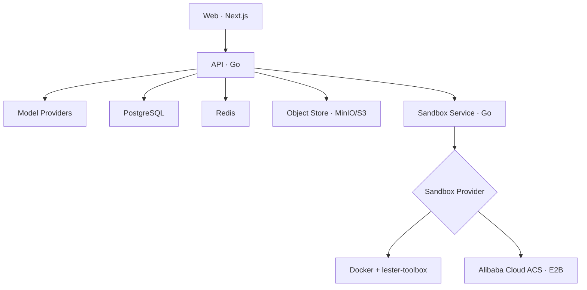

# Lester

**Lester 是一个开源、可自部署的 AI Agent Workspace。**

工作区以对话为主要入口：`/app` 居中展示输入框，发送第一条消息时创建会话，默认由 Lester 在用户专属 Computer 的独立会话目录中完成任务。部署根路径 `/` 提供公开项目官网。

> Lester 不是 Workflow/DAG 编排平台，不提供拖拽节点、条件分支或流程画布。

## 项目官网与帮助文档

根路径 `/` 为极简公开官网，以居中的“想清楚。做出来。”、一个主要按钮和简短介绍呈现产品定位，并说明名字来自 GTA V 中冷静、机敏的幕后黑客 Lester Crest。通过轻量导航保留工作区、帮助文档、实际 GitHub 仓库和问题反馈入口。`/docs` 为站内帮助文档，包含快速开始、使用指南、模型配置、部署与升级及常见问题。官网和文档采用静态渲染，无需登录或访问 API；工作区保留在 `/app`，登录页和账户菜单提供官网/帮助入口。

站内文档内容位于 `frontend/src/lib/site-docs.tsx`。修改产品能力、环境变量或迁移要求时同步更新。进入工作区沿用现有登录流程，不会自动发送任务；本次官网无需新增数据库迁移或部署服务。已有部署需重建 Web 容器并刷新页面才能看到新版首页。

## Lester 能做什么

- 使用邮箱和密码注册、登录，自动创建个人 Workspace
- 左下角账户菜单统一进入个人资料、模型、Computer 和 Skill 设置；称呼与内置头像主题可持久化修改
- 在 Workspace 中配置自己的模型 Provider 和密钥
- 支持 OpenAI、Anthropic、Azure OpenAI、OpenAI-compatible、AWS Bedrock、Google Vertex AI 和 Microsoft Foundry
- 通过 Workspace 级 SSE 实时输出 Agent 回复和当前思考/工具活动；刷新后按持久化事件游标无重复续流，左侧会话栏仅在会话运行或正在停止时展示状态，并用一次性未读提示告知后台任务完成或失败；运行区展示当前动作和耗时，发送键在运行期间变为停止键，可随时终止当前任务
- 完整保存中间回复、工具调用与工具结果；模型请求按完整 ToolExchange 管理工作集，默认保留最近 10 次工具交互
- 单次任务不限制模型/工具循环次数；运行会持续到模型完成、发生明确错误或运行上下文被取消
- 无需选择 Agent，首页直接输入目标即可开始；默认使用 Lester 和已配置的默认模型，也可切换模型、添加附件。首页围绕 760px 输入区组织内容，小屏自适应；Agent 选择与“试试一个任务”按需展开，示例只填草稿。顶部教学与产物管理使用带名称和提示的轻量图标；桌面项目/会话操作在悬停或键盘焦点时出现，触屏始终可见。点击“新对话”只返回输入页，不提前创建空会话。旧会话保留原角色以兼容已有历史。
- 为每个用户分配一个 Computer（本地 Docker 或阿里云 ACS Agent Sandbox），并以 `/workspace/conversations/{conversationId}` 隔离会话目录
- Agent 可以在 Computer 中执行命令、读写文件和使用终端
- 终端连接真实交互式 Bash PTY，支持 Tab 命令/路径补全、↑↓ 历史与前缀查找、Ctrl+R 历史搜索、Ctrl+C 中断、Ctrl+L 清屏和窗口尺寸同步；多行粘贴等待 Enter 执行。选择内容后可用工具栏、Ctrl+Shift+C / ⌘C 复制，Shift+Esc 离开终端焦点。手机提供 Tab、历史、Esc、Ctrl+C 和 Ctrl+D 按钮；断线可重连，但会启动新 Shell，不恢复正在运行的进程。
- 命令历史保存在各会话的 `.agent/terminal/bash_history`，属于 Computer 私有数据；敏感命令以空格开头可避免记录。自定义镜像未装 Bash 时会提示并回退到 `sh`。提供的 `backend/Dockerfile.sandbox-runtime` 已包含 `bash-completion`、`less` 和终端定义；命令参数补全依赖相应工具的补全脚本。现有包含 Bash 的 Computer 更新 Web 与 Sandbox Service 即可获得行编辑支持；新增镜像包需重建运行时镜像及 ACS 模板 / 新 Computer，不要删除已有工作区来升级。
- 右侧 Files 提供类似 VS Code 的目录树与文件预览，支持代码/文本行号、图片、PDF，以及受限 iframe 中的 HTML 页面预览、源码切换和独立页面打开；桌面端可拖动调整右侧面板宽度，并可收起左侧会话栏
- 文件工作区支持最多 8 个打开标签、Markdown 预览/源码、下载、放大预览和窄屏文件面板。聊天下方的任务文件卡片在本轮输出结束（或失败、停止）后才展示已确认存在的当前文件，生成期间不占据回复底部；右侧文件列表和预览仍实时更新。“让 Agent 修改此文件”会给输入框添加可移除的文件引用，发送时只附相对路径提示，不自动注入文件内容。
- 会话栏支持按标题搜索；文件目录按内容占用高度，变化列表按需展开。专注预览可暂时收起目录，预览/源码与文件操作集中在同一工具栏，为内容留出更多空间。
- 切换会话和刷新页面会恢复草稿、文件引用、打开标签、预览/源码模式、目录展开状态及聊天/源码阅读位置。状态按用户、工作区和会话保存在当前浏览器标签页中，最多保留 50 个会话，持久化草稿最多 100,000 字符；退出登录会清除。尚未上传的本地附件仅在页面内切换时保留，刷新后明确提示重新选择，不会保存文件内容到浏览器存储。
- 阅读历史时不会被流式输出强制拉到底部，有新输出时可一键跳转。运行状态使用真实工具事件和耗时，工具参数/输出默认折叠；运行中可以先写下一条草稿，但不会并发发送。源码更新保留阅读位置，文件更新不抢走当前预览；HTML 自动刷新仍可能重置页面内部交互状态，不放宽 iframe 安全限制。
- 文件列表在文件操作及工具/任务结束事件后自动同步；页面可见时，运行中每 5 秒、空闲每 15 秒检查文件元数据，覆盖 bash 和后台脚本的变更。扫描最多 64 个目录、2000 个文件、5 层子目录，默认跳过依赖、缓存和 `.agent` 目录（仍可手动展开）；超出或读取不完整时显示提示。轻量变化列表合并本轮持久化文件事件与本次打开期间检测到的增删改，不是完整文件历史、内容 Diff 或 Checkpoint；同大小且同修改时间的内容变化无法靠元数据识别。
- Computer 空闲后自动暂停并在下次访问时恢复；服务会持续校验真实状态，Docker 使用用户级 Volume，ACS 使用云端 Sandbox 暂停/唤醒
- 内置 Skill 广场，并支持把 Skill 安装到当前会话的 `.agent/skills` 后按需加载
- 支持会话附件上传和在聊天框直接粘贴图片；文件只写入 `.agent/upload`，模型默认只接收文件路径提示，不会自动注入文件内容

## 当前不包含

为保持产品聚焦，当前版本不包含以下能力：

- Workflow/DAG 编辑器与执行引擎
- 可视化流程编排
- 多 Agent 编排界面
- Knowledge Base/RAG 产品
- Memory
- 浏览器自动化
- Artifact 持久化、Computer 快照和 Docker/ACS 工作区自动迁移

## 系统结构



Web、API 和 Sandbox Service 分别构建和运行在独立容器中。Sandbox Service 通过统一 Provider 接口负责 Computer 生命周期、命令、文件和交互式终端；上层只保存不透明的 `provider_ref`，不感知 Docker 容器名或 ACS Sandbox ID。Docker 模式由 Sandbox Service 独占挂载 Docker Socket，并把静态 Go 二进制 `lester-toolbox` 安装到 Computer；ACS 模式使用 OpenKruise 官方 Go E2B SDK，不挂载 Docker Socket。私有接口要求 API 使用内部 Bearer Token，只有健康检查无需认证。Skill 安装包由 API 通过对象存储接口访问，当前 Compose 使用兼容 S3 API 的 MinIO。

## 沙箱机制

Lester 采用“**每个用户一个持久化 Computer，每个会话一个独立目录**”的模型。这样既不会随着会话数量增加而创建大量容器，又能保持会话之间的文件边界。

```text
User
└── Computer workspace mounted at /workspace
    └── conversations/
        ├── {conversationId-A}/
        ├── {conversationId-B}/
        └── {conversationId-C}/
```

### 隔离边界

- 一个用户只对应一个逻辑 Computer；Docker 下对应一个容器和持久化 Volume，ACS 下对应一个云端 Sandbox。
- 每个会话固定使用 `/workspace/conversations/{conversationId}` 作为工作目录。
- Agent 的 `bash`、`read`、`write`、`edit` 工具，以及右侧 Files 和 Terminal，都由服务端强制限定在当前会话目录。
- 文件路径在服务端进行规范化和越界检查；其他会话目录和 `/tmp` 等容器路径不能通过文件工具访问。
- Docker 的 `lester-toolbox` 会在容器内部再次验证真实路径和符号链接边界，并提供原子写入；ACS 通过官方运行时文件 API 实现同一 Provider 契约。两者都保留 25 MiB、目录项数、行长度和命令输出限制。
- `computer_list_files` 不作为 Agent 工具暴露；Agent 使用 `bash` 配合 `ls`、`find` 或 `rg --files` 查找文件。

### 生命周期与故障恢复

每次使用 Computer 前，API 都会通过 Sandbox Service 核对 Provider 的真实状态，而不是只相信数据库中的状态：

1. Computer 不存在时创建 Provider 资源；ACS 返回的动态 Sandbox ID 会立即写入 `provider_ref`。
2. Computer 已停止或暂停时，自动恢复运行。
3. Computer 状态异常时执行 Provider 对应的恢复流程。
4. Computer 正常后，自动创建当前会话目录并将命令、文件和终端操作切换到该目录。
5. 后台监控默认每 30 秒同步一次 Provider 状态；默认空闲 30 分钟后暂停，下次使用时自动恢复。

创建和恢复使用 PostgreSQL 用户级 advisory transaction lock，多个 API 副本不会为同一用户并发创建多个 Computer。Docker 删除或重建容器不会主动删除用户 Volume；ACS 使用暂停/唤醒保存工作区，但当前不提供快照、跨 Provider 迁移或被销毁后的自动文件恢复。

### 资源与后台任务

默认 Docker Sandbox 使用 `python:3.12-slim`，便于 Agent 执行用户要求的 Python 任务；Lester 自身的文件工具不依赖该解释器。Computer 默认禁用容器网络，并限制为 2 CPU、4 GB 内存和 256 个 PID，同时启用 `no-new-privileges`。

ACS Provider 支持 `native` 与 `private` 两种 E2B 路由。生产默认使用 Native（需要泛域名 DNS/TLS）；Private 使用单域名 `/kruise` 路径，适合内网接入和测试。创建默认启用 `secure` 与 `autoPause`，运行时访问令牌由每次 connect 获取且不会写入 Lester 数据库。

`bash` 支持 `run_in_background: true`。后台命令会立即返回任务 ID、PID 和 `.lester/tasks/{taskId}.log`，Agent 可以随后使用 `read` 查看日志。前台 Bash 默认超时 120 秒，最大可配置为 600 秒。

`bash` 的 stdout/stderr 会在 Sandbox Provider 边界分别限制为 256 KiB，并保留开头与结尾及明确的省略字节数；返回模型前仍会应用约 30,000 字符的工具结果限制。`read` 使用流式按行读取，只返回所需范围，不会为了读取几行而把整个大文件载入内存。`load_skill` 同样受单次结果限制。

`read` 返回带行号的文本，格式为“右对齐的行号 + Tab + 原始内容”，行号从 1 开始。例如 JSON 中的 `"     1\tport: 8080"`。读取范围仍使用 `offset` / `limit`；达到行数或字符限制时返回连续的一页与 `next_offset`，不会把开头和结尾拼成一段。单行超过 2000 字符会明确标记截断，需使用更精确的命令检查剩余部分。编辑时不要把行号和分隔 Tab 写入文件，原有缩进则需保留。常见图片扩展名会以受限的 base64 `images[]` 附件返回：Anthropic-compatible 模型使用原生 image block，OpenAI-compatible 模型使用配套的 vision image part，不会把 base64 当普通文本发送；单张图片上限 8 MiB。

## 围绕成果继续工作

Agent 成功写入、编辑或登记文件后，会先同步确认文件存在，再自动在右侧打开。运行中检测到的命令生成文件也会打开。文件以多标签组织（最多 8 个），同一路径复用标签；可以切换、关闭，刷新后保留已打开文件和各自的查看方式。HTML 默认在隔离 iframe 中预览，支持切换源码，后续修改会同步最新内容。左右方向键与 Home/End 可切换标签，Delete 关闭当前标签。历史事件或重复投递不会反复弹出已关闭的文件；内部运行目录和依赖目录不会自动打开。手机端自动打开文件面板，可关闭后继续对话。

任务结束后，会话中已同步的 HTML 网页与 Markdown 文档集中展示为成果卡片，支持预览、下载和“继续修改”。点击继续修改只引用该文件并回到输入框，保留已有草稿，不会自动发送。HTML 卡片可打开现有部署对话框，由用户明确发布。

Computer 的“成果”标签和手机端“⋯ → 查看会话成果”可打开同一成果列表。Agent 可通过 `register_deliverable` 为真实存在的 HTML/Markdown 文件登记标题、摘要、来源任务和入口文件 SHA-256；同一路径再次登记保留成果 ID，每个会话最多登记 200 项。已登记成果优先展示，仍兼容按文件类型发现旧成果；自动发现会排除依赖、隐藏目录、Agent 资源及 README/AGENTS/SKILL 等常见辅助文档。明确登记的 Markdown 文档可作为成果。

页面只为当前文件清单中确认存在的文件显示卡片，后续追问和刷新后仍可查找。其他本轮相关文件折叠展示。登记摘要由 Agent 撰写，摘要和入口摘要值均不代表验收通过；预览仍显示当前文件，不是历史内容快照，也不会自动发布。执行失败、停止、目录范围不完整及成果记录同步失败时会明确提示。任务执行期间可在文件面板查看生成中的文件。

运行执行器已与会话服务拆分，但仍在 API 进程内运行。关键运行状态与事件、待投递记录在同一 PostgreSQL 事务中保存；Redis 投递失败会保留记录并重试，重复事件按 ID 去重。正常停机时会中断运行并清理守卫，不会自动重放工具；暂未引入独立 Worker 或任务恢复队列。

## 上下文存储

- `messages` 保存用户输入、中间/最终助手消息、`tool_calls` 和 `tool` 结果；`run_id` 关联执行，`tool_call_id` 配对调用与结果。完整保存的是工具实际返回给模型的内容（包括截断提示），不是未截断的所有文件或命令输出。
- 每个会话按数据库生成的递增 `seq` 恢复历史，不再依赖时间戳或随机 UUID 排序。
- `runs` 记录触发消息，以及当次 System Prompt、工具定义、模型 ID、输出参数和历史起点快照信息（`history_through_seq` 为初始历史的末尾序号），不保存 Provider 密钥。
- `run_events` 继续供界面展示执行过程。工具开始/完成/失败事件携带调用 ID，完成/失败事件包含工具结果；它们不替代消息历史。
- 浏览器只保持一条 Workspace 级 SSE，后台会话通过 `conversation_id` 更新左侧运行摘要；打开会话时单独拉取最近 1,200 条持久化事件。浏览器在 `sessionStorage` 保存 Workspace 事件游标，刷新后只补缺失事件，前端始终按事件 ID 幂等合并。
- 用户停止任务时，Run 会从 `running` 持久化进入 `cancelling`，执行进程取消模型流和前台工具后落为 `cancelled` 并产生 `RUN_CANCELLED`。已经开始但没有结果的工具调用会补一条“已取消、结果未知”的工具结果，避免破坏后续模型上下文；已发生的外部副作用不会自动回滚。页面刷新可从 PostgreSQL 恢复正在运行或正在停止的 Run；Redis/SSE 只负责实时通知。
- 同一会话一次只执行一个 Run；重复发送返回 HTTP 409，且不会提前插入消息。不同会话仍可并行。每个运行使用一个额外的数据库会话持有锁，因此数据库需直连或使用 session pooling，不能使用 transaction pooling。
- 进程中断后，下一次发送会将无主运行标记为失败，为尚未返回结果的工具补充“执行中断、结果未知”的记录，不会自动重跑工具。已发生的文件修改不会自动撤销。部分模型流会保留为不完整审计记录，但不作为完整消息传给后续模型。
- 默认会话查询仍只展示用户消息和最终回答；`GET /api/v1/conversations/{id}?include_internal=true` 可查看完整有序记录（需正常登录与 Workspace 权限）。

### 工具上下文工作集

工具执行记录不等于模型上下文。每一轮模型请求（包括同一个 Run 内的工具循环）都会从完整有序历史生成只读投影，不修改数据库记录或 UI 历史：

| 状态 | 默认规则 | 发给模型的内容 |
| --- | --- | --- |
| FULL | 最近 10 个 ToolExchange；尚未被模型看到的最新工具批次也全部保护 | 原始调用参数 + 完整的模型可见结果 |
| REFERENCE | 窗口外的 read、edit、write、普通成功 bash 或后台任务 | 紧凑历史记录，包含执行引用、文件/实际读取范围、命令/退出码或任务日志路径；不再发送原始大参数和结果 |
| EVICTED | 模型已消费的低价值成功结果，如 list_files、白名单中的裸 pwd/ls/git status | 调用和结果一起省略，原 assistant 正文仍保留 |

- 按单次调用计数，不按消息或批次计数。同一 assistant 消息里的多个工具可以分别降级，但保留的调用和结果必须配对。REFERENCE 在原 assistant 位置呈现为带标记的历史数据，不伪造可执行工具参数。
- `error`、`is_error`、`ok:false`、非零 `exit_code` 或失败/中断状态会额外 PIN 为 FULL。只有后续批次中可验证的同操作成功才解除：bash 要求相同命令且前后台模式相同（忽略超时/描述），read 要求相同文件路径；其他工具要求等价 JSON 参数。不同命令、后台任务刚启动、同批次成功或对话中的“已经修好”不会自动解除。
- 低价值判断使用精确命令白名单，不会把 `pwd && go test`、带重定向的 `ls` 或搜索结果误删。当前搜索通过 bash 执行，窗口外保留命令与退出码引用，不猜测命中文件。`load_skill`、未知工具和无法识别的结果保守保持 FULL。
- 引用里的 `tool_execution_id` 由 `run_id:tool_call_id` 组成，用于定位完整记录，不是新增工具。重新 read 得到的是当前文件状态，不保证等于历史快照；不要为了恢复输出盲目重跑可能有副作用的 bash 命令。后台任务引用保留 `task_id` / `log_path`。
- `MODEL_STARTED.payload.tool_context` 记录策略版本、FULL/REFERENCE/EVICTED/PIN 数量和裁剪前后正文/参数字符数；这是字符统计，不是精确 token 用量。`runs.context` 保存策略版本和默认窗口大小。

这层管理与单次工具输出限制同时生效，无需新增数据库迁移（仍需已有的 004）。暂不包含对话摘要、自动压缩、Memory、RAG 或总 token 预算；普通对话、历史引用及未解决错误仍可能增长。首次接入已有会话时也会应用这套策略。

### 已有部署升级

已有 PostgreSQL Volume 不会重新执行 Docker 的初始化 SQL。先备份数据库、停止 API 写入，并确认已应用迁移 001–003，再执行一次：

```bash
docker compose --env-file deploy/.env -f deploy/docker-compose.yaml stop api
docker compose --env-file deploy/.env -f deploy/docker-compose.yaml exec -T postgres \
  sh -c 'psql -v ON_ERROR_STOP=1 --single-transaction -U "$POSTGRES_USER" -d "$POSTGRES_DB"' \
  < backend/migrations/000004_durable_transcript.up.sql
docker compose --env-file deploy/.env -f deploy/docker-compose.yaml exec -T postgres \
  sh -c 'psql -v ON_ERROR_STOP=1 --single-transaction -U "$POSTGRES_USER" -d "$POSTGRES_DB"' \
  < backend/migrations/000005_user_profiles.up.sql
docker compose --env-file deploy/.env -f deploy/docker-compose.yaml up -d --build api
```

全新部署会自动执行 004–005。004 保留旧聊天记录的原有排序，但不能补回旧版本从未保存的工具结果；005 为用户资料增加内置头像主题。回滚 SQL 保留消息文本，不过旧 API 不理解新增工具消息；完整应用降级应使用备份恢复。

### 成果登记与可靠事件升级

当前版本需要迁移 001–015；账号机制的 013 迁移见下方“账号、第三方登录与头像”。上面的 004–005 命令仅说明历史聊天升级，不足以升级到当前版本；请按编号补齐所有尚未执行的迁移。若数据库已完成 001–011，先备份、停止 API 写入，再执行一次 012，并继续补齐 013、014、015 后重建 API/Web：

```bash
docker compose --env-file deploy/.env -f deploy/docker-compose.yaml stop api
docker compose --env-file deploy/.env -f deploy/docker-compose.yaml exec -T postgres \
  sh -c 'psql -v ON_ERROR_STOP=1 --single-transaction -U "$POSTGRES_USER" -d "$POSTGRES_DB"' \
  < backend/migrations/000012_deliverables_events.up.sql
```

全新 Compose 数据卷会按序执行 001–015；已有数据卷不会自动升级，勿删除数据卷。012 回滚会删除成果登记和待投递记录，保留原文件、消息、运行事件及已发布站点；回滚前停止新版 API，并配套恢复兼容的应用版本。Redis 长期不可用时待投递表会增长，需要监控数量和磁盘空间。

## 账号、第三方登录与头像

登录页支持邮箱密码以及部署方配置的 Google / GitHub 登录。首次注册会创建一个 Personal Workspace 和默认项目，新账号始终是普通成员。`AUTH_REGISTRATION_ENABLED=false` 关闭邮箱和第三方的**新账号注册**，已有账号仍可登录、绑定身份。注册校验有效邮箱、1–60 字称呼和至少 10 字符、不超过 1024 字节的密码；界面要求确认密码。

在 `deploy/.env` 配置：

| 服务 | 变量 | 授权回调地址 |
| --- | --- | --- |
| Google | `GOOGLE_OAUTH_CLIENT_ID`、`GOOGLE_OAUTH_CLIENT_SECRET` | `<WEB_ORIGIN>/api/v1/auth/oauth/google/callback` |
| GitHub | `GITHUB_OAUTH_CLIENT_ID`、`GITHUB_OAUTH_CLIENT_SECRET` | `<WEB_ORIGIN>/api/v1/auth/oauth/github/callback` |

Google 在 Cloud Console 的 Google Auth Platform 创建 Web application 客户端，配置授权页面、测试用户或正式发布状态，并添加精确回调地址。GitHub 在 Developer settings 创建 OAuth App，每个部署环境使用对应回调的应用。回调应经同源 Gateway / Ingress 转发到 API。生产环境必须 HTTPS，并设置 `SESSION_COOKIE_SECURE=true`；HTTP 仅限 localhost 开发。未配置的完整变量对会隐藏对应按钮；只填一项会拒绝启动。密钥只放 `.env` 或 Kubernetes Secret。API 需能访问第三方 HTTPS 接口；授权范围为 Google 的 `openid email profile` 和 GitHub 的 `read:user user:email`。

身份按第三方稳定用户 ID 识别，邮箱必须由服务商确认已验证，GitHub 私有邮箱也支持。回调使用单次、10 分钟有效、绑定浏览器的状态和 PKCE S256；Access Token 不持久化。相同邮箱**不会自动合并账户**：先用原方式登录，再到“个人资料 → 登录方式”绑定。绑定不会改写原邮箱、称呼、工作区或文件。解除绑定需保留其他已配置的登录方式或密码，并退出其他设备、轮换当前会话。停用账号仍无法登录。

配置 SMTP 后，新邮箱注册必须验证，登录页提供“忘记密码”和重新发送验证邮件；旧账号保持可用，可从资料页补充验证。不配置 SMTP 时保留自部署的即时注册方式，邮箱显示未验证，邮件操作隐藏。验证链接有效 24 小时，找回密码链接有效 30 分钟，数据库仅保存摘要且只能使用一次；令牌放在 URL fragment，页面读入后立即移除，操作需明确提交。找回密码撤销所有会话和待处理安全令牌；设置页修改密码保留轮换后的当前会话、退出其他设备。

```dotenv
SMTP_HOST=smtp.example.com
SMTP_PORT=587
SMTP_TLS_MODE=starttls
SMTP_USERNAME=your-mail-account
SMTP_PASSWORD=your-mail-password
SMTP_FROM=no-reply@example.com
```

发件地址需获得邮件服务授权。465 端口可用 `SMTP_TLS_MODE=tls`；`starttls` 要求服务端支持 TLS 且证书有效。明文 `plain` 仅限 localhost 测试。申请邮件对未知、停用和符合条件的账户返回相同信息；邮件失败可检查 API 的 `account mail request failed` 日志。注册邮件发送失败时账户仍需验证，可重新发送；关闭 SMTP 不会让待验证账号自动获得访问权。Helm 的 ID/邮件参数位于 `config.auth`，密钥位于 `secrets.googleOAuthClientSecret`、`secrets.githubOAuthClientSecret`、`secrets.smtpPassword`；使用 `existingSecret` 时按需加入三个对应环境变量密钥。

头像支持小于 2 MiB 的 PNG/JPEG/GIF，服务端居中裁剪并转为 256×256 PNG，GIF 使用首帧且移除元数据；拒绝单边超过 4096 像素或总量超过 1200 万像素的图片。照片存入现有私有对象存储，仅通过已登录的 `/api/v1/me/avatar` 读取，失败回退到首字头像。第三方首次注册尝试导入头像，失败不阻止登录；资料页支持上传、恢复主题、明确使用已绑定账号的照片。远程获取仅允许指定 Google/GitHub HTTPS 图片主机，不跟随跳转、限定时间/大小且不携带凭证。替换或删除的旧对象会尽力清理；备份对象存储时包含头像。

已有部署先备份、停止 API 写入；数据库在 001–012 时依次执行一次 013、014、015。已完成 013 时执行下方“逐步新手引导”中的 014、015：

```bash
docker compose --env-file deploy/.env -f deploy/docker-compose.yaml stop api
docker compose --env-file deploy/.env -f deploy/docker-compose.yaml exec -T postgres \
  sh -c 'psql -v ON_ERROR_STOP=1 --single-transaction -U "$POSTGRES_USER" -d "$POSTGRES_DB"' \
  < backend/migrations/000013_account_identity.up.sql
# 最新 API/Web 需先应用 014、015，再启动。
docker compose --env-file deploy/.env -f deploy/docker-compose.yaml exec -T postgres \
  sh -c 'psql -v ON_ERROR_STOP=1 --single-transaction -U "$POSTGRES_USER" -d "$POSTGRES_DB"' \
  < backend/migrations/000014_user_guides.up.sql
docker compose --env-file deploy/.env -f deploy/docker-compose.yaml exec -T postgres \
  sh -c 'psql -v ON_ERROR_STOP=1 --single-transaction -U "$POSTGRES_USER" -d "$POSTGRES_DB"' \
  < backend/migrations/000015_rotating_tokens.up.sql
docker compose --env-file deploy/.env -f deploy/docker-compose.yaml up -d --build api web
```

保留 `.env`、原密钥和数据卷。全新卷自动初始化 001–015，已有卷不会自动升级。PowerShell 用 `Get-Content -Raw` 管道传入 `exec -T postgres`。013 回滚会删除身份、令牌和头像引用，存在无密码账号时会拒绝回滚；降级前先安排密码恢复并配套兼容版本。工作区、项目和文件不迁移。实际 OAuth 授权与邮件投递需使用部署方真实配置验收。

## 逐步新手引导

新账户首次进入工作区会看到 7 步入门教学，可随时选择“稍后再学”。工作区顶部、账户菜单和设置页的“新手引导”可以重新打开教学中心，包含首次任务、模型、项目、文件成果、Agent、上下文库、Computer、Skill、个人资料和产物发布，共 10 类教学。功能页首次访问会显示可关闭的教学提示。进度按账户和主题保存，换设备也可继续，完成后可重新看一遍；已有账户升级后不强制弹出欢迎教学。

引导只解释界面，不会自动发送任务、调用模型、安装 Skill 或发布文件。打开模型配置时，已有任务草稿继续保留。完成模型教学不代表模型服务已验证；仍需一次真实运行确认。

已有数据库完成 001–013 后，先备份，再执行一次 014、015 并重建 API/Web：

```bash
docker compose --env-file deploy/.env -f deploy/docker-compose.yaml stop api
docker compose --env-file deploy/.env -f deploy/docker-compose.yaml exec -T postgres \
  sh -c 'psql -v ON_ERROR_STOP=1 --single-transaction -U "$POSTGRES_USER" -d "$POSTGRES_DB"' \
  < backend/migrations/000014_user_guides.up.sql
docker compose --env-file deploy/.env -f deploy/docker-compose.yaml exec -T postgres \
  sh -c 'psql -v ON_ERROR_STOP=1 --single-transaction -U "$POSTGRES_USER" -d "$POSTGRES_DB"' \
  < backend/migrations/000015_rotating_tokens.up.sql
docker compose --env-file deploy/.env -f deploy/docker-compose.yaml up -d --build api web
```

保留原 `.env`、加密密钥与数据卷；更早的部署先按编号补齐缺失迁移。全新 Compose 卷包含 014、015；Helm 在部署前手动应用 SQL。014 回滚只移除教学进度，需配套恢复兼容的 API/Web。进度接口限定当前登录用户，不能读写其他账户的进度。

## Skill 与附件机制

Skill 广场的元数据保存在 PostgreSQL，版本化安装包保存在对象存储。`backend/internal/blob.Store` 是存储边界，当前实现连接 MinIO，也可以替换为 AWS S3 或其他兼容实现。服务启动时会写入三个默认 Skill：Code Review、Project Planner 和 Data Explorer。

Skill 是会话级能力：安装后解包到 `/workspace/conversations/{conversationId}/.agent/skills/{slug}`，数据库记录会话与 Skill 的关系。运行时 Prompt 只列出已安装 Skill 的名称、说明与路径；Agent 必须调用 `load_skill` 读取 `SKILL.md` 后才能使用它。卸载会同时清理当前会话目录和安装关系，不影响其他会话。

附件上传后写入 `/workspace/conversations/{conversationId}/.agent/upload`。消息只记录附件元数据，并向模型提供文件路径、原始名称、类型和大小，不会预先解析文件，也不会把文件内容直接塞入上下文。Agent 只有在任务确实需要时才使用 `read` 或 `bash` 检查附件。

| 服务 | 本地端口 → 容器端口 | 用途 |
| --- | ---: | --- |
| Nginx Gateway | `13000 → 8080`（可配置） | 唯一默认入口，页面与 API 同源 |
| Web | 仅 Compose 内网 `3000` | 用户界面 |
| API | 仅 Compose 内网 `8080` | 登录、模型配置、对话和 Agent Runtime |
| Sandbox Service | 仅 Compose 内网 `8090` | Computer 生命周期、命令、文件和终端 |
| PostgreSQL | 仅 Compose 内网 `5432` | 持久化业务数据 |
| Redis | 仅 Compose 内网 `6379` | SSE 事件分发 |
| MinIO | 仅 Compose 内网 `9000` / `9001` | Skill 安装包对象存储（S3 兼容） |

## 快速启动

### 环境要求

- Docker
- Docker Compose v2

### 1. 准备配置

```bash
cp deploy/.env.example deploy/.env
```

`deploy/.env.example` 不再内置任何密码或密钥。复制后必须填写 `POSTGRES_PASSWORD`、`MASTER_KEY_BASE64`、`SANDBOX_SERVICE_TOKEN` 和 `MINIO_ROOT_PASSWORD`，可以分别生成：

```bash
openssl rand -hex 24       # POSTGRES_PASSWORD
openssl rand -base64 32    # MASTER_KEY_BASE64
openssl rand -hex 32       # SANDBOX_SERVICE_TOKEN
openssl rand -hex 24       # MINIO_ROOT_PASSWORD
```

### 2. 启动 Lester

```bash
docker compose --env-file deploy/.env \
  -f deploy/docker-compose.yaml \
  up --build
```

### 3. 开始使用

1. 打开 <http://localhost:13000>，点击“进入工作区”前往 `/app`
2. 注册账号并登录
3. 点击首页的 **配置第一个模型**，或前往 **Settings → Models**。先保存服务商连接，再填写 Model ID；名称可以留空，高级设置仍支持自定义地址与 JSON 参数。首个模型默认勾选为个人默认模型，也可以取消。
4. 在首页输入目标，发送第一条消息即可开始与 Lester 的会话

配置完成后可返回原项目，继续使用已保留的消息草稿。保存配置并不验证服务商访问权限，首次任务才会确认模型是否可调用。首页任务示例只填入输入框，不会自动发送。手机会话页的 **…** 菜单提供模型切换和已发布产物管理，**文件** 按钮打开预览面板。助手消息中以行内代码显示的文件名，匹配当前会话文件清单时可直接点击预览。

### 统一网关与部署配置

Compose 使用轻量 Nginx 网关：`/api` 和 `/api/*` 保留原路径转发到 API，其余请求转发到 Web。浏览器只访问一个地址，登录 Cookie、SSE、终端 WebSocket、附件和 HTML 预览均经过该入口。网关不实现业务鉴权、不直接读取用户文件，也不公开 Sandbox Service；预览仍由 API 鉴权并返回原有 CSP。

- 默认入口为 `http://localhost:13000`。如果端口被占用或被 Windows 保留，可在 `deploy/.env` 同时设置 `GATEWAY_PORT=13080` 和 `WEB_ORIGIN=http://localhost:13080`。远程访问时将 `WEB_ORIGIN` 改为用户实际访问的源（协议、域名、端口），否则终端的 Origin 校验会拒绝连接。
- Web 镜像在构建时固定使用空 `NEXT_PUBLIC_API_URL`（同源）；旧 `.env` 中该变量不再影响 Compose。升级必须重新构建 Web，单改运行时环境变量不能修改已经打包的浏览器代码。独立前端开发仍可自行设置该构建变量。
- SSE 禁用代理缓冲和缓存；终端支持 WebSocket Upgrade。API 代理读超时为 **1 小时空闲时间**，不是 Agent 的运行时限，SSE 心跳会保持连接。请求失败时网关不会自动重放 API 请求。
- 网关允许最多 26 MiB 请求体；API 继续限制单文件 25 MiB（余量用于 multipart 封装）。`/healthz` 只检查网关存活，不代表数据库或上游服务就绪。
- 默认仅公开网关端口。临时排查可追加 `-f deploy/docker-compose.debug.yaml`（或 `make dev-debug`），将 API `18080`、MinIO `9000/9001` 仅绑定到 `127.0.0.1`；浏览器仍走网关。排查结束用默认 Compose 重新 `up -d` 收回这些端口。
- 默认入口为 HTTP，未内置证书申请。公网部署应配置 HTTPS 并设置 `SESSION_COOKIE_SECURE=true`。可在 Nginx 配置中增加 TLS listener、挂载证书并发布对应端口；如果由外层负载均衡终止 TLS，应让网关只接受该可信代理的访问，再配置正确的外部协议转发，不能直接信任公网传入的 `X-Forwarded-Proto`。当前配置主动覆盖该头为本层协议。

已有部署升级网关无需新数据库迁移；保留原 `.env` 密钥和数据卷，更新 `WEB_ORIGIN` 后运行完整的 `docker compose ... up -d --build`，不要只重启 API，也不要删除数据卷。移除旧覆盖文件中 Web/API 的端口映射；自定义入口端口应配置在 gateway，而不是 web。

代理回归测试使用独立 Compose 项目，不访问应用数据、不开宿主机端口：

```bash
make gateway-check
# 如果测试失败，清理测试容器（不涉及 Lester 的数据卷）：
docker compose -p lester-gateway-test -f deploy/gateway/compose.test.yaml down
```

测试覆盖路由与转义路径、Cookie/请求头、私有预览 CSP、25 MiB 上传、SSE 首帧和双向 WebSocket；CI 自动执行同一测试。

## Kubernetes / Helm 部署

Helm Chart 位于 `deploy/helm/lester`，部署 Web、API、Sandbox Service、ClusterIP Service、可选 Ingress 和 NetworkPolicy。PostgreSQL、Redis、S3 兼容对象存储由集群外部提供；安装前需按编号执行 `backend/migrations/*.up.sql`。

先构建并推送 Web、API 和 Sandbox Service 三个镜像，然后准备私有 values（不要提交真实密钥）。ACS 若不使用已有运行镜像，还需用 `backend/Dockerfile.sandbox-runtime` 构建并推送 Sandbox 运行镜像：

```bash
docker build -f backend/Dockerfile.sandbox-runtime -t registry.example.com/lester-sandbox-runtime:v1 backend
docker push registry.example.com/lester-sandbox-runtime:v1
```

该镜像提供 Bash、Python、Node.js、Git、ripgrep 及 `lester-toolbox`，并满足 ACS Agent Runtime 对 `/bin/bash`、`cp`、`mv`、`mkdir` 的要求。

基础 values 示例：

```yaml
images:
  api: {repository: registry.example.com/lester-api, tag: v0.1.0}
  web: {repository: registry.example.com/lester-web, tag: v0.1.0}
  sandboxService: {repository: registry.example.com/lester-sandbox-service, tag: v0.1.0}

config:
  webOrigin: https://lester.example.com
  objectStore: {endpoint: s3.example.com, bucket: lester-skills, useSSL: true}

secrets:
  databaseURL: postgres://...
  redisURL: redis://...
  masterKeyBase64: ...
  sandboxServiceToken: ...
  objectStoreAccessKey: ...
  objectStoreSecretKey: ...

ingress:
  enabled: true
  className: nginx
  host: lester.example.com
  tls:
    - secretName: lester-tls
      hosts: [lester.example.com]

sandbox:
  provider: docker
  nodeSelector: {lester.dev/docker-worker: "true"}
```

```bash
helm upgrade --install lester deploy/helm/lester \
  --namespace lester --create-namespace \
  -f values.production.yaml
```

Ingress 使用同源路由：`/api` 转发到 API，其余请求转发到 Web，因此 Helm 镜像构建时无需设置 `NEXT_PUBLIC_API_URL`。Kubernetes 继续直接使用 Ingress，不重复部署 Compose 的 Nginx。按所选 Ingress Controller 的配置方式关闭 SSE 缓冲、支持 WebSocket、放宽空闲超时和上传大小，并正确转发外部协议；具体参数不跨 Controller 通用。

Docker 是默认 Provider。Sandbox Service 固定一个副本，并通过 `sandbox.nodeSelector` 放到提供 Docker Engine 和 `/var/run/docker.sock` 的专用 Worker；Docker Socket 等同于很高的节点权限，不符合 Restricted Pod Security，且用户 Volume 属于该节点。

在 ACS 集群上可以切换为 Agent Sandbox Provider：

```yaml
secrets:
  # 与 ack-sandbox-manager 的 adminApiKey 一致
  acsSandboxAPIKey: ...

sandbox:
  provider: acs
  replicas: 2
  acs:
    domain: sandbox.example.com
    protocol: native # 生产推荐；private 适合单域名内网/测试
    template: lester-agent
    secure: true
    autoPause: true
    sandboxSet:
      enabled: true
      replicas: 4
      image: registry.example.com/lester-sandbox-runtime:v1
```

ACS 模式不挂载 Docker Socket，Sandbox Service 可以多副本运行。Chart 可选创建与 `sandbox.acs.template` 同名的 `SandboxSet` 预热池；也可以关闭 `sandboxSet.enabled` 并使用集群中已有模板。运行镜像至少需要 `/bin/bash` 以及 `cp`、`mv`、`mkdir`；仓库自带镜像默认使用无特权 `sandbox` 用户。部署前按[阿里云 E2B 接入文档](https://help.aliyun.com/zh/cs/user-guide/connect-to-agent-sandbox-using-the-e2b-sdk)安装/升级 `ack-agent-sandbox-controller` 与 `ack-sandbox-manager` 并配置域名、TLS 和 API Key。Native 需要泛域名 DNS/TLS；Private 使用单域名 `/kruise` 路由。

若使用 `secrets.existingSecret`，它必须包含 `DATABASE_URL`、`REDIS_URL`、`MASTER_KEY_BASE64`、`SANDBOX_SERVICE_TOKEN`、`OBJECT_STORE_ACCESS_KEY`、`OBJECT_STORE_SECRET_KEY`；ACS 模式还必须包含 `ACS_SANDBOX_API_KEY`。切换 Provider 会为用户创建目标 Provider 的新 Computer，当前不会自动迁移旧 Provider 中的文件，正式切换前应另行备份或迁移工作区。

## 仓库结构

```text
lester-agent/
├── frontend/                     Next.js 前端工程
│   ├── src/
│   └── Dockerfile
├── backend/                      Go 后端工程
│   ├── cmd/api/                  API 服务入口
│   ├── cmd/sandbox-service/      Sandbox 服务入口
│   ├── cmd/lester-toolbox/       注入 Computer 的静态文件 Helper
│   ├── internal/                 后端内部实现
│   │   ├── agenttool/            工具注册表与独立工具 Handler
│   │   ├── toolboxfs/            Helper 的安全文件操作与协议
│   │   └── model/                模型存储、运行时契约与 Provider 集成
│   ├── prompts/                  Agent 系统 Prompt
│   ├── migrations/               PostgreSQL 迁移
│   ├── Dockerfile.api
│   ├── Dockerfile.sandbox-runtime
│   └── Dockerfile.sandbox-service
├── deploy/                       Docker Compose、环境配置与 Helm Chart
├── AGENTS.md                     编码 Agent 的开发约束
├── Makefile
└── README.md
```

这是一个 Monorepo，但前端和后端拥有独立的依赖、构建上下文与 Dockerfile。API 和 Sandbox Service 同属 Go 后端工程，但会编译成两个可执行程序并运行在两个容器中。

Agent 工具通过注册表扩展，每个工具独立维护参数 Schema 和执行逻辑；模型 Provider 通过 `internal/model/integration.Provider` 注册，数据库 Store 与对话运行时不包含具体 Provider 分支。详细扩展约束见 [`backend/ARCHITECTURE.md`](backend/ARCHITECTURE.md)。

Agent Runtime 默认不设置全局模型最大输出长度。OpenAI-compatible Provider（包括 DeepSeek 等）在未显式配置时不会发送 `max_tokens`，由模型服务按自身能力决定；Anthropic、Vertex Anthropic 和 Bedrock Anthropic 等协议强制要求输出上限的 Provider，会由各自适配器提供协议级兜底值。

## 开发检查

后端：

```bash
cd backend
go mod tidy
go test ./...
```

前端：

```bash
cd frontend
pnpm install --frozen-lockfile
pnpm lint
pnpm build
```

也可以在仓库根目录执行：

```bash
make test
make web-check
```

## 安全提示

本次扫描与修复见 [2026-10-10 安全报告](docs/security-audit-2026-10-10.md)。Go 构建升级至 1.26.9 以应用当前安全补丁。

网关 / Ingress 部署需将实际可信代理的 CIDR 填入 `AUTH_TRUSTED_PROXY_CIDRS`（逗号分隔），Helm 对应 `config.auth.trustedProxyCIDRs`。用 `docker network inspect <网络名称>` 查看网关 IP / 子网，优先信任专用代理的 `/32` 或 `/128`，或其受控子网；地址变化时更新，并限制 API 只接受该代理。留空会忽略所有转发头，同一网关后的用户共用网关 IP 的限流桶。禁止使用 `/0` 或信任无关服务。只读取可信连接提供的 `X-Forwarded-For`；默认网关覆盖该头并移除 `True-Client-IP`。

模型接口须直接响应 API 请求，不再跟随重定向，避免密钥和对话内容外泄。终端单条消息限制 1 MiB。已建立的终端 / 事件连接每 30 秒复核会话，在退出登录、禁用账号或移除工作区成员后关闭（数据库检查最多另需 5 秒）。

- 不要在生产环境使用示例 `MASTER_KEY_BASE64`
- 不要在生产环境使用示例 `SANDBOX_SERVICE_TOKEN`；Sandbox Service 不应公开暴露
- Provider 密钥使用 AES-GCM 加密后存储
- HTTPS 部署会默认使用 Secure 会话 Cookie；登录和注册按身份与客户端 IP 做分钟级限流，Redis 故障时拒绝受限操作，默认客户端 IP 为实际 TCP 连接地址；续期按账号与 IP 限制每分钟 60 次
- Sandbox Service 拥有 Docker Socket 权限，生产部署时应运行在隔离的专用 Worker
- User Computer 默认禁用网络，并限制 CPU、内存和 PID 数量
- 文件 API 与终端默认进入 `/workspace/conversations/{conversationId}`，不会把其他会话目录展示为当前会话文件

## 双令牌登录、头像裁剪与独立 HTML 预览

邮箱、Google 和 GitHub 登录统一签发两个 HttpOnly/SameSite Cookie，数据库只存摘要：**access token 两小时过期**；**refresh token 30 天过期**，每次续期都会轮换并重新计算 30 天。持续使用没有累计登录时长上限；30 天未续期则需要重新登录。浏览器在到期前、受保护请求被认证中间件拒绝后自动续期，并协调多个请求和标签页。仅重试尚未进入业务处理的认证拒绝，网络故障不会清空草稿。退出登录及密码、账号安全变更撤销整个令牌组；超过 5 秒并发宽限后重用已消费的 refresh token 会撤销该设备的令牌组。

上传头像后，可拖动或用方向键调整位置、缩放、手机双指缩放、旋转、重置，并查看圆形头像效果。点击“保存头像”才上传裁剪后的 256px PNG；取消不更改原头像。已有图片或第三方头像可点击“调整裁剪”。HTML 的“在新页面打开”仅显示私有、隔离的 HTML 及本地资源，可跳转同一会话内已验证的 HTML 文件，不再带入侧栏、终端、文件面板，也不会发布网站。

数据库已完成 **001–014** 时，先备份、停止 API 写入，执行一次 **015** 后重建 API/Web。更早版本先按编号补齐缺失迁移：

```bash
docker compose --env-file deploy/.env -f deploy/docker-compose.yaml stop api
docker compose --env-file deploy/.env -f deploy/docker-compose.yaml exec -T postgres \
  sh -c 'psql -v ON_ERROR_STOP=1 --single-transaction -U "$POSTGRES_USER" -d "$POSTGRES_DB"' \
  < backend/migrations/000015_rotating_tokens.up.sql
docker compose --env-file deploy/.env -f deploy/docker-compose.yaml up -d --build api web
```

015 会使旧登录失效，升级后需重新登录一次，账号、个人资料、项目与文件不受影响。保留原 `.env`、加密密钥与数据卷。全新 Compose 卷初始化 001–015；Helm 部署前手动执行 SQL。015 回滚也会撤销登录，需配套兼容的 API/Web。有效期为应用固定默认值，无需新增环境变量。
